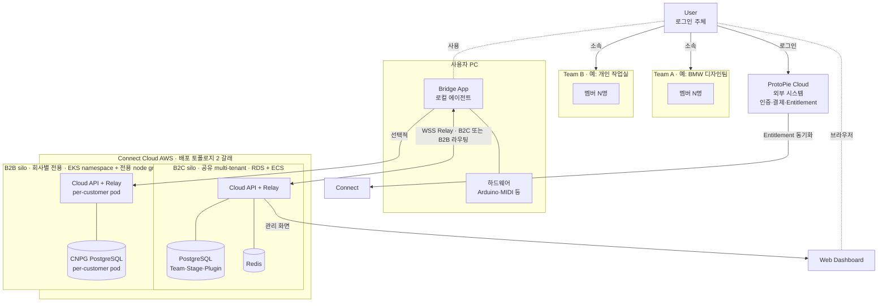

# PRD - Draft

> Notion 최종본 아카이브 · 원본: https://app.notion.com/p/35745184b5da80398889cad96345e77c
> Notion view 시점: 2026-06-08T06:48:09.679Z
> CoC 스쿼드 종료(2026-06-30) 인수인계용. 원본 마크다운(표 포함) 그대로 보존.

---

# 목차 {toggle="true"}
	<table_of_contents color="gray"/>
# ProtoPie Connect Cloud PRD
> 작성일: <mention-date start="2027-04-26"/> <br>마지막 업데이트: 2026-05-27 (🔄 5/26 유저플로우 논의 반영 — §6-0 신설)<br>상태: 초안<br>대상 독자: PO / PM / 디자이너 / 엔지니어 모두
---
## 0. Executive Summary — 한 페이지
> **본 §0은 5분 reader용 lean summary**. 같은 정보의 다른 깊이 cut이며 §0가 충돌하면 본문이 source of truth.
	**확정**: 신규 Connect는 **앱을 새로 작성**한다 (레거시 코드 마이그레이션 아님). 기존 Connect의 **모든 기능을 가져감** (UX·stageview는 일부 개선 포함되나 핵심 가치는 아님). **로컬 서버 모드와 클라우드 통신을 동시 지원하는 hybrid**. Beta는 **Connect 기능이 클라우드 환경에서 작동하는지** 검증한다 (분산 하드웨어 협업은 클라우드화로 가능해지는 시나리오 중 하나일 뿐, 클라우드화의 *목적*은 아님).
	**타겟**: B2C (P1 개인·P2 소규모 팀) + **B2B (P5 회사·조직 멤버 — 현재 Connect 사용자 base의 다수)** 하이브리드.
### 🎯 Beta 최우선 2가지 — 모든 결정의 기준
> **이 두 항목 위에 다른 우선순위는 없다**. 모든 trade-off·범위 조정·deferral 결정 시 본 순위가 tie-breaker.
1. **기존 Connect → 신규 앱 전환** — 레거시 사용자 가시 기능을 신규 앱에서 동등 이상으로 보장. **코드는 재작성, 기능은 보존** (§1-4·§1-5 정합)
2. **클라우드 환경에서 Connect 기능 사용 가능** — 모든 핵심 워크플로가 cloud-mediated 환경에서 작동 (분산 하드웨어 협업·stageview·Stage 협업 등 §6-6·§6-7)
> 이외 항목(Debugger 모드 F-BRG-16, HTML import F-BRG-17 등 신규 기능, 운영 메트릭, UX 개선)은 모두 위 2가지의 **하위 또는 보조** 위치. 위 2가지가 위협받으면 다른 항목은 deferral 대상.
**일정**: 개발 5/11\~6/15 (**5주, user research·기획·디자인·엔지니어링 모두 포함**) + QA 6/16\~6/30 (2주) → **출시 2026-06-30** (§2-0)
### Goals
*Beta 종료 시점에 어떤 결과가 나오면 성공인가? — §0 최우선 2가지 priority의 직접 측정.*
**Priority 검증 (필수, Beta의 전부)**:
- 🔁 **Priority #1 — 레거시 → 신규 앱 완전 재작성**: 레거시 사용자 가시 기능 47개가 신규 앱에서 동등 이상으로 작동. 코드는 새로 작성, 기능은 보존
- ☁ **Priority #2 — 클라우드 환경에서 Connect 기능 구현**: 모든 핵심 워크플로가 cloud-mediated 환경에서 작동·반복 사용. cloud-only 환경에서 Connect가 정상 운영 가능한 수준에 도달
**보조 outcome (공통 토대)** — 위 2개를 떠받치는 운영 수준:
- 👤 **온보딩 정착**: 가입자가 Beta 종료 시점에 Pie·Stage 를 자력으로 만들고 본인 워크플로에 정착
- 🛡 **격리·운영 신뢰성**: cross-Team 유출 사고 0건, Multi-AZ failover 정상 동작
> **시나리오별 검증 (S10·S11·S12 등)은 Goals가 아니라 §5에서 다루는 측정 항목**. S10 분산 하드웨어 협업·S11 stageview 개선·S12 Stage 모델은 모두 Priority #1·#2가 작동하는지 *증명하는 신호*이지, Beta의 *목적* 자체는 아님. 클라우드화의 목적은 “Connect 기능이 클라우드에서 작동” 이지 특정 시나리오를 위한 것이 아니다.
	**수치 임계값(Go/No-Go·시나리오별 성공 기준 등)은 미결정**. **레거시 Connect 사용 데이터 추출 후 baseline을 도출하고, 그 baseline 대비 비교 기준을 §2-3에 추가한다** — 본 §0 Goals는 정성 outcome만.
상세: §2-3.
### Users
*누가 이 도구를 쓰며, 무엇을 하려 하는가?*
<table header-row="true">
<tr>
<td>페르소나</td>
<td>역할</td>
<td>핵심 needs</td>
</tr>
<tr>
<td>**P1**</td>
<td>개인 사용자 (B2C)</td>
<td>본인 PC에서 빠르게 프로토타입 시연. 레거시 동등 사용성 + 클라우드 동기화</td>
</tr>
<tr>
<td>**P2**</td>
<td>소규모 B2C 팀</td>
<td>팀원 초대로 Pie·플러그인·Stage 공유. 결제·멤버십을 1 Team에 모음</td>
</tr>
<tr>
<td>**P5**</td>
<td>B2B 팀 멤버 (현재 Connect 사용자 base 다수)</td>
<td>회사·조직 단위 결제·**멤버 간 자료 공유**·중앙 거버넌스. 빠른 파이 공유와 협업이 회사 보안·정책 안에서 가능</td>
</tr>
<tr>
<td>**P4**</td>
<td>하드웨어 통합 개발자</td>
<td>각자 PC에 가진 하드웨어를 클라우드 세션에 통합 (S10 시나리오 검증자)</td>
</tr>
</table>
상세: §4.
### Problem
*고객은 지금 무엇에 막혀있는가? 우리가 풀면 충성도·사용률은 어떻게 올라가는가?*
**현재 Connect 사용자(다수가 B2B 회사 고객)의 실제 피드백 기반 누적 friction** (구체 고객 evidence는 §1-2-1 요약·<mention-page url="https://app.notion.com/p/35745184b5da805fa715f8ef460ad2cb"/>  부록 A 상세 참고):
- **LAN-only / localhost bound** — Stageview·웹 임베드를 모바일/원격에서 사용 불가. *Toyota Japan, TomTom, Amazon, Zoox+Aston Martin, **Canny 200+ vote**(가장 오래되고 지지 많은 요청)*
- **외부 공유·원격 협업 차단** — API 연동 prototype을 외부 공유 못 함, ngrok 우회는 회사 IT가 차단. *Zillow Group, Disney Streaming*
- **하드웨어 결합 작업이 단일 PC에 갇힘** — UT·prototype 테스트가 회사 멤버 PC에 분산된 하드웨어를 통합 못 함. *Mindray Medical, Inovance Technology, Midea (intelligent hardware/medical/home appliance)*
- **단일 사용자 가정 → 회사 거버넌스 부재** — 보안·로컬 배포 요구 미충족. *Huawei, BMW China, BYD, GM (high-security 기업)*
- **차량 플랫폼 성능·안정성 한계** — 고충실도 prototype 실행 시 명확한 lag, 대용량 Pie 안정성 문제. *Seres, Great Wall Motor(장성자동차), Voyah, Lingshu, Pan Asia, American Honda*
- **메모리 인증·매일 반복 friction** — 앱 재시작마다 로그인·PIN 손실 (cumulative daily friction)
> **외부 정량 evidence**: **2026년 2개월간 중국 25개 핵심 기업 방문 (전부 B2B)** — 자동차 OEM 13곳·인텔리전트 하드웨어·의료기기·인터넷·가전 등 100-billion groups·unicorns·head enterprises. 4가지 핵심 이슈(performance bottleneck · data integration · product functions · deployment)이 위 friction과 일치 — <mention-page url="https://app.notion.com/p/35745184b5da805fa715f8ef460ad2cb"/>  부록 A-11 참고.
이 friction이 **사용 빈도·만족도·충성도를 깎고 있음**. cloud 전환의 주된 목표는 *시장 트렌드 추종이 아니라* **고객 니즈 충족 → 충성도·사용률 제고**:
- §1-3 핵심 가치 #1 (**손쉬운 접근**) — 누적 friction 일괄 해소 → 매일 사용 만족도·재방문률 상승
- §1-3 핵심 가치 #2 (**빠른 파이 공유와 협업**) — 회사 워크플로우에 정착 → 이탈 감소·도입 확산
> 시장의 SaaS·실시간 협업 흐름(Figma·Framer 등)은 사용자 *기대치를 높이는* 보조 컨텍스트. 우리 사용자도 같은 기대를 가지지만, 결정 동기는 우리 사용자의 누적 friction 자체.
상세: §1-2 (레거시 한계 11개) · §1-2-1 (고객 피드백 요약) · §1-3 (사용자 관점 핵심 가치 2가지).
### Scope
*Beta에 무엇이 들어가고, 무엇이 빠지는가?*
**들어감** — 기능 기준 2x2 분류:
### 기존 기능 유지·개선 (레거시 동등 보장)
- **사용자 노출**: USB/Serial/MQTT 하드웨어 통합 / 커스텀 플러그인 / PIN 인증 / IFTTT·API·폰트 / 로컬 서버 모드 / Studio 연동 (STU-1·STU-2)
- **백엔드**: 인증·세션 영속화 (메모리 → DB·Redis) / 빌드 보호 강화
### 신규 기능 개발
- **사용자 노출**: 분산 하드웨어 협업 (S10) / Team 내 Stage 모델 (디스코드 채널) / 클라우드 통신 모드 (hybrid의 새 축) / Web Dashboard / Debugger 모드 (F-BRG-16) / Socket 기반 HTML 프로토타입 import (Beta 실험적, F-BRG-17)
- **백엔드**: `@ppc/local-server` (Fastify + Socket.IO) 신규 작성 / 단일 모노레포 (`apps/web` + `apps/desktop` + `apps/local-server`) / 2-process Electron (main + child fork) / Multi-tenancy 아키텍처 — v0.7.0: Team 이 root entity, Device 도 Team-scoped, user identity 는 ProtoPie Cloud SoT / 격리 메커니즘 (자동 필터·RLS) / 수평 확장 stateless 서버
**안 들어감**: AI 기능 (Bridge IDE의 Claude SDK 등), 플러그인 마켓플레이스·서명, 3rd-party 플러그인 생태계, on-prem, Team 간 자원 공유 등
상세: §2-0 (들어감) · §3 (안 들어감).
### Key Flows
*§1-3 핵심 가치 2가지가 사용자 워크플로우에서 어떻게 작동하는가? — 검증 시나리오 3건. 단, 시나리오는 *priority 작동을 보여주는 신호*이지 Beta의 목적 자체는 아님 (§0 priority frame 참고).*
- **S10 — 분산 하드웨어 협업** *(핵심 가치 #2 빠른 파이 공유와 협업 검증)*: 멤버 A가 Arduino, 멤버 B가 MIDI를 각자 PC에 연결 → 같은 Stage 에서 Bridge에 Pie 로드 → 한 Pie 세션이 두 PC의 하드웨어를 동시 사용. *레거시: 시연 시 모든 하드웨어를 한 PC에 모아야 함 → Beta: 각자 PC에서 협업*
- **S11 — stageview 미러링** *(핵심 가치 #1 손쉬운 접근 검증, 단순 개선)*: Bridge가 stageview 시작 → 모바일/웹 viewer가 Cloud Relay 경유 미러링 + **시청자가 Pie 목록에서 시청할 Pie 선택**. *레거시: LAN bound·모든 Pie 강제 시청 → Beta: 어디서나·선택적 Pie*
- **S12 — Stage 생성·초대·격리** *(핵심 가치 #2 빠른 파이 공유와 협업 검증)*: 사용자가 Team 안에 Shared Stage 생성 → 멤버 초대 (role: editor/viewer) → Pie/플러그인/Relay 세션이 Stage 단위로 격리 (디스코드 채널 모델). *레거시: 자원 분리 부재 → Beta: 회사·팀 워크플로우에 정착 가능*
상세: §5 (S1 / S1-2 / S3 / S8 / S10 / S11 / S12 + S-ERR 카탈로그).
### Open Questions
*아직 결정 안 끝난 항목은 무엇인가?*
- **D2 + D12** 메시지 envelope + 하드웨어 효과 idempotency 정책 (per-Bridge `monotonic seq` + Redis dedupe window) — ARCH §8-1
- **D4** Bridge 빌드 보호 구체 수단 조합 (asar 암호화 / JS 난독화 / 네이티브 모듈) — ARCH §8-1
- **§2-3 정량 목표** 임계값 — 레거시 Connect 데이터 추출 후 baseline 비교 기준으로 추가
상세: ARCH §8-1 (D-항목) · ARCH §9 Week 1 (Launch checklist).
## 1. 배경
### 1-1. 현재 제품: ProtoPie Connect (Legacy)
`protopie-connect/` 디렉토리는 현재 운영 중인 ProtoPie Connect 제품의 코드베이스.
> **이미 상용 운영 중인 제품이며, 신규 Beta는 이 제품의 차세대 버전을 만드는 작업이다.**
### 현재 판매 모델
- ProtoPie Cloud의 **Addon 형태로 판매**. 사용자가 Cloud 계정으로 Addon을 구매해야만 Connect 사용 가능
즉 **Connect는 무료 도구가 아니며**, 신규 Beta도 동일한 유료 구조를 유지·확장한다. 단, B2B Cloud 환경에 대해서는 <mention-page url="https://app.notion.com/p/35745184b5da805fa715f8ef460ad2cb"/> 문서에서 다시 이야기 한다.
**현재 가치 제안**:
- ProtoPie 프로토타입을 **실시간 멀티 디바이스 환경**에서 테스트
- USB / Serial / MQTT를 통한 **하드웨어 통합** (Arduino, IoT, 게임패드)
- ProtoPie Cloud에서 프로토타입 **단방향 다운로드**
- PIN 기반 **로컬 네트워크 원격 접근**
- ZIP 기반 **커스텀 플러그인** 실행 (IFTTT, API 등)
**핵심 형태**: 같은 Node.js 서버 코어를 두 가지 모드로 제공.
- **Desktop 모드**: Electron 셸로 감싼 데스크톱 앱 (macOS / Windows). **인증은 두 갈래** — (a) ProtoPie Cloud OAuth 로그인 (Cloud Relay·동기화 사용) / (b) **로그인 X · 라이선스 키 만 입력** (LAN 단독 운영, 로컬 DB 만 사용, Cloud 의존성 0 — 레거시 `LicenseManager` `.lic` 후신). schema 는 <mention-page url="https://app.notion.com/p/35e45184b5da80d39866ccef7a508db1"/> 별도, Cloud DB 와 동기화 없음
- **Server 모드 (RUNMODE=server)**: Linux 등에서 헤드리스 데몬으로 동작 — R&D 랩, 키오스크, 자동화 환경 (Beta scope-out: GUI 모드만)
### 1-2. 레거시의 구조적 한계
> **중요**: 레거시 **기능**(stageview·플러그인·하드웨어 통합·로컬 서버 등)은 모두 신규 앱에서 동등 이상으로 보장된다. 한계는 **그 기능들이 올라타는 토대**(아키텍처·운영·보안·확장성)에 있다.
	각 한계 항목 끝의 *고객 cite*는 §1-2-1 요약·[STRATEGY 부록 A](./STRATEGY.md) 상세의 실제 고객 피드백 근거. 일부 항목은 architectural·internal 성격이라 cite 없음.
- **하드웨어 결합 작업의 공유·협업 차단**: 시연·테스트가 작동하려면 모든 하드웨어를 한 PC에 강제로 모아야 함 → 회사 멤버끼리 **하드웨어·작업·결과를 공유 못 함**. 각자 PC에 흩어진 하드웨어로 협업하는 워크플로우 불가능 (§1-3 핵심 가치 #2 “빠른 파이 공유와 협업”의 가장 큰 차단 요인). *Cite: Mindray Medical·Inovance Technology·Midea (UT+Connect+hardware), BMW China (steering wheel·pedal·rotary 자동차 물리 입력)*
- **SaaS화 토대**: Server 모드가 있지만 단일 사용자·메모리 상태라 멀티테넌트 배포 부적합. *Cite: **Canny 200+ vote** — “ProtoPie Studio/Connect 웹 버전 + 실시간 협업”이 가장 오래되고 지지 많은 요청. 2026 China visit 25개 B2B 기업 모두 SaaS-grade 토대 기대*
- **사용자 모델 — 단일 사용자 가정**: 한 사람만 쓰는 구조 → 회사·팀 단위 운영 불가. *Cite: 모든 B2B 고객 (Huawei·BMW·BYD·GM·Mindray·Inovance·Midea 등 100% B2B in 2026 China visit) — 회사 단위 사용 전제*
- **인증 상태**: 메모리 저장 — 앱 재시작 시 모든 로그인·PIN 손실 (매일 사용자에게 매일 반복되는 friction)
- **확장성**: 단일 프로세스 — 사용자 늘어도 서버 추가 불가 *(internal/architectural)*
- **클라우드 연동**: 단방향 다운로드만 — **공유·협업·동기화 토대 없음**. Pie·작업 결과를 클라우드 통해 회사 멤버와 공유하는 흐름 부재. *Cite: Zillow Group (API 연동 prototype 클라우드 호스팅 외부 공유 필요, ngrok 우회 회사 IT 차단), Disney Streaming (외부 네트워크 원격 UT 필요), Toyota Japan/TomTom/Amazon (Stageview 모바일·웹 임베드 필요)*
- **플러그인 보안**: 격리 없음 — 임의 프로그램이 사용자 PC 전체 접근 가능. *Cite: Huawei·BMW China (보안 강한 기업의 격리 deployment 요구)*
- **코드 구조**: 모놀리식 — 부분 교체 어려움 *(internal/architectural)*
- **모니터링**: 로깅만 — 운영 지표·장애 추적 도구 없음 *(internal/operational)*
- **DB — 사용자 PC 안의 파일**: 클라우드 백업·이전 어려움 → 인력 변동 시 자산 소실. *Cite: **NIO** — 1년 사이 팀 변동으로 proficient user 거의 없음, 과거 training 성과·asset 모두 소멸 (2026 visit report)*
- **멀티테넌시**: 개념 자체 없음 — 회사·조직·팀 구분 못 함 → 중앙 결제·거버넌스·라이선스 통합 불가. *Cite: 모든 B2B 고객의 회사 단위 운영 needs (P5 페르소나 §4-4 직접 evidence)*
> 신규 Connect의 작업 = **“기능 추가”가 아니라 “동일 기능을 SaaS·멀티테넌트·클라우드 협업 가능한 토대 위에 재구현”** (UX·stageview는 부수적으로 일부 개선 — Beta 핵심 가치 아님). 항목별 신규 해소는 §1-4 비교 매트릭스 참고.
### 1-2-1. 사용자 요구사항 — 실제 고객 피드백 evidence
> 다음은 레거시 Connect 사용자(다수가 B2B 회사 고객)의 **실제 요구사항·피드백 요약**. §0 Problem·§1-3 비즈니스 동기·§4-4 P5 페르소나·F-BRG-16 Debugger 모드 등 본 PRD 전반의 *구체적 근거 데이터*. 전체 고객별 상세는 <mention-page url="https://app.notion.com/p/35745184b5da805fa715f8ef460ad2cb"/>  부록 A 참고.
	**Source**: ① 글로벌 고객 individual 요구사항·Canny 투표 (A-1\~A-10) + ② **2026 Customer Visit Report — 중국 25개 B2B 기업 2개월 심층 방문** (A-11). 두 소스 모두 동일한 4가지 핵심 이슈(performance·data integration·deployment·product functions)에서 강한 cross-validation.
<table header-row="true">
<tr>
<td>#</td>
<td>카테고리</td>
<td>핵심 요구 (요약)</td>
<td>대표 고객</td>
<td>본 PRD 매핑</td>
</tr>
<tr>
<td>1</td>
<td>**웹/클라우드 기반 Connect**</td>
<td>API 연동·외부 공유·Stageview 모바일·웹 임베드</td>
<td>Zillow / Disney / Toyota / TomTom / Amazon / Zoox+Aston Martin / **Canny 200+ vote** (가장 오래·지지 많은 요청)</td>
<td>**§0 priority #2 직접 evidence** — 클라우드 환경 작동</td>
</tr>
<tr>
<td>2</td>
<td>**Connect 환경에서 UT**</td>
<td>Connect + UT 통합 (아이트래킹·히트맵·녹화 등)</td>
<td>J&J / Mindray / Inovance / Midea / 현대차 / Google Wearable / Samsung DA</td>
<td>UT는 Beta scope-out, Post-Beta candidate (수요 증명 evidence)</td>
</tr>
<tr>
<td>3</td>
<td>**오프라인 / 온프레미스**</td>
<td>보안 환경 오프라인 모드</td>
<td>BMW China / 현대차 / Huawei / BYD / GM</td>
<td>Beta scope-out (On-prem Post-Beta). 단 §6-4 hybrid 로컬 모드는 부분 충족</td>
</tr>
<tr>
<td>4</td>
<td>**성능·안정성**</td>
<td>차량 플랫폼·대용량 Pie 안정성</td>
<td>Seres / 장성자동차 / Voyah / Lingshu / Pan Asia / American Honda</td>
<td>§7 비기능 운영성 evidence</td>
</tr>
<tr>
<td>5</td>
<td>**Stageview 제어**</td>
<td>카메라/Unity 레이어 동적 제어·온보딩</td>
<td>Continental / Scania / 내부</td>
<td>§6-7 stageview (단순 개선 범위)</td>
</tr>
<tr>
<td>6</td>
<td>**API**</td>
<td>Keep-alive·data binding·AI Connect</td>
<td>Zoox / GM / J&J / 42dot</td>
<td>§6 plugin·integration evidence</td>
</tr>
<tr>
<td>7</td>
<td>**Multi 디바이스 / 스크린**</td>
<td>여러 Pie/디바이스 동시 제어</td>
<td>GM / Scania (최대 5 Pie) / Zoox+Aston Martin</td>
<td>S10·S11·§6-6 Relay 시나리오 evidence</td>
</tr>
<tr>
<td>8</td>
<td>**파일·설정 관리**</td>
<td>설정 백업·LocalSend 탐지</td>
<td>Rivian / CT / 내부</td>
<td>운영 §6-1·§6-3 evidence</td>
</tr>
<tr>
<td>9</td>
<td>**디버깅 UX**</td>
<td>message flow tracing (source→destination)</td>
<td>Scania / 내부</td>
<td>**F-BRG-16 Debugger 모드 직접 evidence**</td>
</tr>
<tr>
<td>10</td>
<td>**하드웨어 연동**</td>
<td>자동차 프로토콜 / RPi5</td>
<td>BMW China / Scania / ProtoPioneers</td>
<td>§6-4 Bridge·하드웨어 통합 evidence</td>
</tr>
</table>
> **이 표가 보여주는 것** — 가장 큰 요구는 **카테고리 #1 “웹/클라우드 기반 Connect”** (Canny 200+ vote = 가장 오래되고 지지 많은 요청). 이는 **§0 priority #2 (클라우드 환경에서 Connect 기능 구현)와 정확히 일치** — Beta scope의 직접적 근거. 또한 **고객 다수가 자동차 OEM·헬스케어·가전 등 B2B 회사**라는 점이 §4-4 P5 페르소나(B2B 다수)의 직접적 근거.
	**요구 ↔︎ Beta scope 정합성 결론**:
	- **Beta 직접 충족**: #1 (P#2 직결), #5·#6·#7·#9·#10 (관련 시나리오·기능에 부분\~전부 포함)
	- **Post-Beta deferral**: #2 UT, #3 온프레미스 — 본 PRD §3 Non-goals와 정합 (수요는 분명, Post-Beta 우선 대상)
	- **Beta 운영 측면**: #4 성능·안정성, #8 파일·설정 관리 — §7 비기능·§6 운영 요구사항으로 흡수
### 1-3. 비즈니스 동기 — Why now?
> **본 절의 결정 동기는 *고객 니즈 충족 → 충성도·사용률 제고*** — 시장 트렌드 추종이 아니다. 시장 흐름은 사용자 기대치 상향의 보조 컨텍스트일 뿐.
**현재 사용자(다수가 B2B 회사 고객)의 누적 friction 사례**:
- 메모리 인증 → 앱 재시작마다 재로그인 (매일 사용자에게 매일 반복되는 friction)
- LAN-only stageview → 원격 멤버·외부 클라이언트 시연 불가
- 단일 PC 의존 → 회사 멤버 간 **자료·하드웨어 공유 불가**, 분산 시연·협업 어려움
- 단일 사용자 가정 → 회사 차원 결제·중앙 거버넌스 부재
- Pie 공유 → 파일 직접 전달·별도 채널, 회사 워크플로우와 분리
이 friction이 **사용 빈도·만족도·충성도를 깎고 있음**. 해소 시 사용자는 두 가지 가치를 얻고, 결과적으로 충성도·사용률 제고로 이어진다.
**보조 컨텍스트 (시장 흐름)**: 프로토타이핑·디자인 도구 시장은 SaaS·실시간 협업으로 이동(Figma·Framer·Axure Cloud). ProtoPie Cloud도 SaaS. 우리 사용자도 같은 기대를 가지지만, *결정 동기는 우리 사용자의 friction 자체*이지 시장 추종이 아니다.
### 클라우드화의 핵심 가치 — 사용자 관점 2가지
> **이 2가지가 클라우드화의 실제 이유**. 특정 시나리오(분산 하드웨어·stageview 개선·Stage 등)는 이 2가지 *위에서 가능해지는 결과물*이지, 클라우드화의 *이유* 자체가 아님.
1. **클라우드화를 통한 손쉬운 접근** — Connect 기능을 어디서나·어떤 디바이스에서나 접근. LAN bound·단일 PC bound·메모리 상태 손실·LAN 경유 시청 등 누적 friction 일괄 해소
2. **빠른 파이 공유와 협업** — Pie를 팀원에게 즉시 공유·함께 작업 가능. 외부 클라이언트는 브라우저로 즉시 시청. 팀 단위 워크플로우의 자연스러운 토대
위 2가지 위에서 **다양한 시나리오가 가능해짐** (S10 분산 하드웨어 / S11 stageview 개선 / S12 Stage 협업 등) — 이들은 *결과 시나리오*. SaaS 매출 모델·플러그인 생태계 기반 등은 *비즈니스 또는 운영 측 이득*이지 사용자 관점 핵심 가치는 아님.
> 시장·경쟁 매트릭스, 24개월 시나리오, 시장 규모 추정, 통신 방식 대안 비교(P2P·VPN·LAN·SaaS Relay) 등 상세 전략 컨텐츠는 <mention-page url="https://app.notion.com/p/35745184b5da805fa715f8ef460ad2cb"/>  참고. 본 PRD는 *무엇을 만드는지*에 집중.
### 1-4. 핵심 차이 매트릭스
> §1-2 한계가 신규 앱에서 어떻게 해소되는지 정리. 신규 Connect는 **레거시 모든 기능을 동등 이상으로 보장** (UX·stageview는 부수적으로 일부 개선되나 핵심 가치 아님). **앱은 새로 작성** (코드 마이그레이션 아님).
	**레거시 사용자 전환 메시지**: “신규 클라우드 버전 Beta 시작, 레거시는 그대로 유지 — 강제 이전 없음”.
<table header-row="true">
<tr>
<td>영역</td>
<td>Legacy</td>
<td>New Connect Cloud (Beta)</td>
</tr>
<tr>
<td>**stageview 미러링**</td>
<td>LAN 한정·모든 Pie 강제 시청·동기화 약함</td>
<td>**선택적 Pie 시청 + Cloud 경유 분산 시청 + 자동 재연결**</td>
</tr>
<tr>
<td>**하드웨어 통합**</td>
<td>단일 PC 한정</td>
<td>**분산 하드웨어 협업** (각 PC의 하드웨어가 한 세션 통합)</td>
</tr>
<tr>
<td>**로컬 서버 모드**</td>
<td>Server 모드로 LAN 운영</td>
<td>**로컬 모드 유지 + 클라우드 통신 모드 hybrid**</td>
</tr>
<tr>
<td>**외부 클라이언트 시연**</td>
<td>화면 공유·VPN 의존</td>
<td>**PIN 기반 Viewer 게스트** (브라우저로 즉시 접속)</td>
</tr>
<tr>
<td>**플러그인 저작**</td>
<td>외부 빌드 후 업로드</td>
<td>**Bridge 내장 IDE**</td>
</tr>
<tr>
<td>**플러그인 공유**</td>
<td>단일 PC 한정</td>
<td>**Team 라이브러리 + Stage 단위 인스턴스**</td>
</tr>
<tr>
<td>**사용자/조직 모델**</td>
<td>단일 사용자</td>
<td>**Team → Device + Stage 격리** (Team 이 결제·격리·소속 root. User identity·membership 은 *ProtoPie Cloud API SoT* — Connect 미저장. JWT 에는 Cloud user ID 만, 권한 판단은 매 요청 Connect 서버 미들웨어가 Cloud API 호출로 처리)</td>
</tr>
<tr>
<td>**인증 상태**</td>
<td>메모리</td>
<td>영속 저장소 (DB·Redis) — 단 user 정체성·role 자체는 ProtoPie Cloud SoT</td>
</tr>
<tr>
<td>**인증 모델**</td>
<td>단일 (`.lic` 파일 + machine ID)</td>
<td>**두 갈래** — (a) Cloud 모드 ProtoPie Cloud OAuth + Device JWT (`@ppc/local-server` schema) / (b) Local 모드 라이선스 키 (`LicenseKey` schema, **클라우드 연결 자체 차단**)</td>
</tr>
<tr>
<td>**Stage 모델**</td>
<td>Group only</td>
<td>**Cloud Stage** (Team-shared, 멤버십·per-Stage role) + **Local Stage** (개인, 라이선스 모드). 로컬 앱 + Cloud 로그인 시 생성 시점에 선택 (변환 불가)</td>
</tr>
<tr>
<td>**클라우드 연동**</td>
<td>단방향 다운로드</td>
<td>**양방향 동기화, 팀 자료 공유·협업**</td>
</tr>
<tr>
<td>**앱 코드베이스**</td>
<td>모놀리식</td>
<td>모노레포 + 모듈 분리, **신규 작성**</td>
</tr>
<tr>
<td>**확장성**</td>
<td>단일 프로세스</td>
<td>무상태 + 수평 확장</td>
</tr>
<tr>
<td>**감사 로그**</td>
<td>없음</td>
<td>모든 변경 작업 기록 (90일 보존)</td>
</tr>
</table>
### 1-5. 레거시 컨셉·패턴 처리 (유지·폐기)
> 사용자 가시 기능 차이는 §1-4 매트릭스 참고. 코드는 새로 작성하되 *개념·구조 차원*에서 어떤 것을 이어받고 어떤 것을 버릴지 정리.
<table header-row="true">
<tr>
<td>카테고리</td>
<td>처리</td>
</tr>
<tr>
<td>**개념 유지** (구조 그대로 이어받음)</td>
<td>24시간 Auth Token 모델 · Manager 패턴 (DI) · ORM 사용 · PIN 기반 원격 접근</td>
</tr>
<tr>
<td>**패턴 폐기** (구조 변경)</td>
<td>메모리 상태 저장 → 영속 저장소 / 데스크톱=서버 → Bridge·Cloud 분리 (로컬 서버는 Bridge 안에 유지) / 단일 사용자 → 멀티테넌트 / DB 강제 초기화 → 마이그레이션 도구 / 하드코딩 비밀 키 → 비밀 관리 / CORS 와일드카드 → 화이트리스트 / IP 판별 보안 → 토큰 인증 / 레거시 코드 재사용 → 신규 작성 (개념·UX만 이어받음)</td>
</tr>
</table>
---
### 1-6. 전체 시스템 한눈에 보기
> 6개 액터(User / Team / Device / Bridge / Cloud / ProtoPie Cloud)의 관계도. 본문에 나오는 모든 용어가 어디 위치하는지 빠른 파악용. (v0.7.0: Tenant 표 제거, Team 이 root entity)

> **silo 두 갈래**: 동일 schema·동일 코드, *호스팅 위치* 만 다름. B2C 는 공유 multi-tenant (Team 별 격리 = RLS·`team_id`), B2B 는 회사별 전용 EKS namespace + per-customer node group + CNPG PostgreSQL pod (회사 단위 물리 격리). 
---
## 2. 목표 (Goals)
### 2-0. Beta Scope — 6월 중순 개발 완료, 6월 말 출시
> Beta는 **Tech Preview** 성격. 2026-06-15 개발 완료 + QA (6/16 \~ 6/30) → **2026-06-30 출시**.
### Beta 일정 — 개발 5주 (5/11\~6/15) + QA 2주 (6/16\~6/30)
<table header-row="true">
<tr>
<td>단계</td>
<td>기간</td>
<td>비고</td>
</tr>
<tr>
<td>**개발**</td>
<td>5/11 \~ 6/15 (5주)</td>
<td>**user research · 기획 · 디자인 · 엔지니어링 모두 포함하는 통합 실행 기간**. 코드 작성만의 시간이 아님</td>
</tr>
<tr>
<td>**QA**</td>
<td>6/16 \~ 6/30 (2주)</td>
<td>통합 테스트·격리 검증·운영 회복성</td>
</tr>
<tr>
<td>**출시**</td>
<td>**2026-06-30**</td>
<td></td>
</tr>
</table>
> **주차별 작업 내용은 본 PRD에서 사전 결정하지 않는다**. 개발 kickoff + 데일리 미팅 + 위클리 미팅을 통해 단계적으로 결정. 본 PRD는 **시작·종료일과 출시일만 고정**하고, 그 사이의 작업 분배·우선순위 조정은 운영 회의체에 맡긴다.
---
### 2-1. 제품 목표
> **본 6개 목표는 §0 Beta 최우선 2가지 (① 기존 Connect → 신규 앱 전환, ② 클라우드 환경에서 Connect 기능 사용 가능)의 하위 구체화**. 충돌 시 §0 priority가 tie-breaker. 아래 list 내 ⭐ 표시는 §0 최우선 직결 항목.
1. ⭐ **레거시 기능 동등 이상 보장 — Beta priority #1**: 레거시 Connect의 모든 기능을 신규 앱에서 동등 이상의 품질로 제공. 코드는 재작성, 기능은 보존
2. ⭐ **클라우드 SaaS 토대 + 로컬 모드 hybrid — Beta priority #2**: 클라우드 통신 모드(분산 협업)를 기본으로 하되, 로컬 서버 단독 모드(오프라인·LAN)도 동시 지원
3. **팀 협업** *(priority #2 하위 구체화)*: 같은 팀 내 프로토타입·플러그인·세션 공유
4. **플러그인 저작 환경** *(priority #1 — 레거시 보존)*: Bridge 내 IDE에서 사용자가 직접 플러그인 작성
5. **UX·stageview 개선** *(보조)*: 레거시 대비 온보딩·**선택적 Pie 시청**·반응성·에러 복구 등 사용자 경험 측면의 명시적 개선 (화질은 현재 수준 유지)
6. **`@ppc/local-server`**** 신규 작성** *(priority #1·#2 공통 토대)*: cloud-poc의 Express 코드는 functional spec 참고용으로만 사용. Fastify + Socket.IO + Prisma 7 기반으로 처음부터 작성하고, 단일 라이브러리(`@ppc/local-server`)를 Desktop child fork 와 Cloud 컨테이너에서 동일하게 boot
### 2-2. 기술 목표
1. 모놀리식 데스크톱 앱 → **Bridge(로컬) + Cloud(중앙)** 분리
2. 메모리 상태 → **공유 저장소(Redis) 기반** 영속 상태
3. 단일 인스턴스 → **수평 확장 가능한 무상태(stateless) 서비스**
4. 단일 사용자 → **Team → Device 2계층 정체성 모델**
5. 플러그인 무제한 권한 → **권한 선언 + 격리 환경 실행**
> 본 PRD의 “확장성” = **기능 확장성**(플러그인·모듈 추가) + **운영 확장성**(트래픽 증가 시 인스턴스 추가, 수평 확장) 양쪽.
### 2-3. 정량 목표 (Beta)
> **Beta는 외부 SLA 약속 없음 — 최선의 노력**. 측정 카테고리는 정의하되, **임계값은 미도입**. 레거시 Connect 사용 데이터 추출 후 baseline을 도출하고, 그 baseline 대비 비교 기준을 본 섹션에 추가한다.
### 결정 모델
1. **레거시 데이터 추출** — 현재 운영 중인 ProtoPie Connect 사용 데이터(DAU·세션 수·기능별 사용 빈도·재방문률·latency 등) 수집·분석
2. **baseline 도출** — 레거시 사용 패턴의 정량 기준선 정리
3. **비교 기준 정의** — Beta 신규는 baseline 대비 (a) parity / (b) +N% improvement 중 어느 방향을 목표로 할지 결정
4. **본 §2-3에 추가** — Go/No-Go 게이트 + 시나리오별·운영 임계값 명시
### 측정 카테고리 (임계값은 baseline 분석 후)
<table header-row="true">
<tr>
<td>영역</td>
<td>측정 항목</td>
</tr>
<tr>
<td>**Go/No-Go**</td>
<td>S10 동시 활성 Device ≥2 세션 누적 카운트</td>
</tr>
<tr>
<td>**S1 / S1-2 온보딩**</td>
<td>가입자 Pie 생성률·첫 N일 retention</td>
</tr>
<tr>
<td>**S10 분산 하드웨어**</td>
<td>동시 활성 Device 세션 수·세션당 Device 수</td>
</tr>
<tr>
<td>**S11 stageview**</td>
<td>세션 누적·동시 시청자·latency p50/p95·재연결 성공률·**선택적 Pie 시청 사용 비율**</td>
</tr>
<tr>
<td>**S12 Stage**</td>
<td>Stage 생성률·Shared Stage 비율·초대→수락→첫 진입 시간·데이터 누출 0건 (정성)</td>
</tr>
<tr>
<td>**운영 (API)**</td>
<td>API p95 응답 지연</td>
</tr>
<tr>
<td>**운영 (Relay)**</td>
<td>Relay 메시지 지연 p95</td>
</tr>
</table>
### 운영 제약 (Beta scope)
<table header-row="true">
<tr>
<td>항목</td>
<td>값</td>
</tr>
<tr>
<td>가용성 (SLA)</td>
<td>약속 없음. 단 **AZ 단일 outage 시 RDS Multi-AZ failover로 분 단위 회복** (NDA에 명시)</td>
</tr>
<tr>
<td>동시 WebSocket 연결 (단일 클러스터)</td>
<td>≤ 100명 (Beta scope 제약)</td>
</tr>
<tr>
<td>멀티 리전</td>
<td>1개 (us-west-2)</td>
</tr>
</table>
> p95 = 100건의 요청 중 빠른 95건의 최댓값. “가장 빠른 95%가 이 시간 안에 처리됨”의 의미.
---
## 3. Non-goals (이번 범위 아님)
<table header-row="true">
<tr>
<td>항목</td>
<td>이유</td>
</tr>
<tr>
<td>**AI 기능 (Bridge·Cloud 양쪽)**</td>
<td>별도 정책 결정 필요. 이번 Beta 제외</td>
</tr>
<tr>
<td>플러그인 마켓플레이스 / 공용 레지스트리</td>
<td>Team 별 프라이빗 공유만</td>
</tr>
<tr>
<td>3rd-party 플러그인 개발자 생태계</td>
<td>사용자 직접 작성만 허용</td>
</tr>
<tr>
<td>플러그인 결제·수익 분배</td>
<td>마켓플레이스 부재로 불필요</td>
</tr>
<tr>
<td>플러그인 import — URL/git 방식</td>
<td>파일 업로드만</td>
</tr>
<tr>
<td>플러그인 코드 서명 / 검수 프로세스</td>
<td>사용자 본인 책임 모델</td>
</tr>
<tr>
<td>On-prem / air-gapped 배포</td>
<td>Beta 는 안 함 (Connect-managed 만). **단 §6-5 의 B2B silo (EKS pod self-managed PG) 구조는 *Post-Beta on-prem 진입 비용을 0 에 가깝게* 만들기 위해 Beta 부터 채택** — 동일 Helm chart 를 customer 자체 OpenShift/Rancher 에 그대로 deploy 가능. STRATEGY 부록 A-3·A-11 evidence (BMW China·Huawei·BYD·GM·현대차 등) 의 향후 진입 경로 보존</td>
</tr>
<tr>
<td>Team 간 자원 공유 / 워크스페이스 초대</td>
<td>격리 우선</td>
</tr>
<tr>
<td>엔터프라이즈 운영 기능 일부 (SSO·SAML·SCIM·CMEK)</td>
<td>Post-Beta. **단 *배포 토폴로지* 차원의 B2B EKS silo 는 §6-5 와 ARCH §8-1 D-silo ADR 에 따라 Beta scope 에 포함** (KICKOFF §3-5 와 정합)</td>
</tr>
<tr>
<td>**Local DB ↔︎ Cloud DB 동기화**</td>
<td>Desktop local 모드 (<mention-page url="https://app.notion.com/p/35e45184b5da80d39866ccef7a508db1"/> ) 와 Cloud silo (<mention-page url="https://app.notion.com/p/35e45184b5da802f941cfd55a371cec7"/> ) 는 **schema·운영·데이터 완전 분리**. Beta 안에서 *Cloud↔︎Local 동기화·import·export* 모두 미지원. 사용자가 라이선스 키 모드와 OAuth 모드 사이를 전환하면 *새 환경* 으로 인지 (이전 작업물 자동 이전 안 함) — Post-Beta 검토</td>
</tr>
</table>
---
## 4. 타겟 사용자 / 페르소나
> 본 페르소나는 마케팅 분류가 아닌 **제품 결정의 기준**으로 활용. 각 페르소나의 핵심 욕구·페인 포인트·성공 기준을 명시.
### Beta 타겟 페르소나
<table header-row="true">
<tr>
<td>페르소나</td>
<td>비고</td>
</tr>
<tr>
<td>**P1 개인 사용자 (B2C)**</td>
<td>단독 사용 시나리오</td>
</tr>
<tr>
<td>**P2 팀 멤버 (소규모 B2C 팀)**</td>
<td>분산 하드웨어 협업(S10)·Stage 협업(S12) 시나리오 검증의 주체</td>
</tr>
<tr>
<td>**P4 하드웨어 통합 개발자**</td>
<td>P1·P2·P5에 분포하는 추가 역량. 플러그인 저작 검증</td>
</tr>
<tr>
<td>**P5 B2B 팀 멤버 (회사·조직)**</td>
<td>**현재 Connect 사용자 base의 다수**. 회사 단위 결제·**멤버 간 자료 공유**·중앙 거버넌스 검증</td>
</tr>
</table>
> **P3 결번**: 이전 framing 에서 *P3 = 엔터프라이즈 IT 관리자* 로 잡았으나, 엔터프라이즈 운영 기능 (SSO·SCIM·EKS·전용 인프라) 이 Post-Beta 로 미뤄지면서 (§3 Non-goals) Beta 타겟에서 빠짐. 번호 재정렬 대신 *P3 결번* 으로 유지하여 외부 doc 의 P4·P5 cross-ref 안정성 보존. Post-Beta 진입 시 P3 재활성화 검토.
> **중요**: 팀 페르소나(P2 소규모 B2C 팀 + P5 B2B 팀)가 Beta 타겟에 반드시 포함되어야 한다. **§1-3 핵심 가치 #2 (빠른 파이 공유와 협업) 검증은 2명 이상 팀이 필요하므로**, P1만으로는 협업·공유 시나리오(S1-2·S10·S12)를 입증할 수 없다.
	**B2B 비중**: 현재 Connect 사용자 base의 다수가 B2B (회사·조직). Beta는 이들을 leave behind하지 않고 신규 클라우드 워크플로우를 함께 검증한다. 단, 엔터프라이즈 운영 기능(SSO·SCIM·EKS·전용 인프라)은 Post-Beta — Beta는 *현재 B2B 고객의 핵심 워크플로우* 검증에 집중.
	**공통 Team 구성**: 모든 페르소나가 동일한 모델 — Team 이 root entity (결제·격리·UI 노출 단위), Team 단위 Addon 구매, 한 사용자가 여러 Team 에 동시 소속 가능 (membership SoT = ProtoPie Cloud). 페르소나별 차이는 **사용 패턴·욕구·페인**.
### 4-1. P1: 개인 사용자 (B2C)
- **프로파일**: 프리랜서·학생·개인 사용자 (디자인·UX 배경). ProtoPie 능숙, 프로그래밍 보조적. 주 2\~5회 프로젝트 단위 사용
- **핵심 욕구**: 본인 PC에서 하드웨어 연결 prototype 시연 · 프로젝트별 Addon 분리 청구
- **페인 포인트**: 외부 서비스 연동(Webhook·IFTTT) 위한 별도 도구 운영 부담 · 클라이언트 시연 환경 차이로 작동 실패
- **성공 기준**: 첫 30분 안에 Arduino 버튼 → prototype 화ania 전환 작동
- **구매 동기**: 개인 프로젝트·학습·포트폴리오·클라이언트 시연
### 4-2. P2: 팀 멤버 (소규모 B2C 팀 — 2\~5명, 프리랜서 콜라보·스타트업·연구 그룹)
- **프로파일**: ProtoPie 일상 사용. 매일 사용. 플러그인 코드 작성은 일부만
- **핵심 욕구**: 각자 PC 하드웨어를 한 prototype에서 동시 사용 (S10) · 동료 플러그인을 그대로 사용 · 원격 팀원과 동시 조작·리뷰
- **페인 포인트**: **레거시 단일 PC 강제 (시연 시 하드웨어 한 PC에 모아야 함)** · 동료 플러그인 직접 복사 부담 · 팀 단위 결제·라이선스 관리 분산
- **성공 기준**: 2명이 각자 PC 하드웨어로 같은 prototype 세션 작동 (S10 시나리오)
- **구매 동기**: 빠른 파이 공유·팀 협업 효율·분산 하드웨어 통합
### 4-3. P4: 하드웨어 통합 개발자 (P1·P2·P5의 추가 역량, \< 10%)
> 섹션 번호 §4-3 과 페르소나 번호 P4 의 mismatch: 페르소나는 P3 결번 (위 *P3 결번* note 참조), 섹션 번호는 sequential. 일부러 다름.
- **프로파일**: 디자이너 또는 개발자 출신, 시리얼·MIDI·하드웨어 프로토콜 경험. *별도 페르소나 아닌 추가 역량*
- **핵심 욕구**: Bridge IDE에서 직접 통합 코드 작성, 팀 동료가 그대로 사용
- **페인 포인트**: 기존엔 외부 ZIP 빌드 후 업로드 필요
- **성공 기준**: Bridge 내장 IDE에서 코드→실행→디버그→저장 한 곳에서
### 4-4. P5: B2B 팀 멤버 — 현재 Connect 사용자 base 다수
> **현재 Connect 고객 다수가 B2B**. Beta는 이들을 leave behind하지 않고 함께 검증. **Beta scope 단서**: 엔터프라이즈 운영 기능(SSO·SCIM·EKS·전용 인프라·on-prem)은 Post-Beta — Beta는 *현재 B2B 고객의 핵심 워크플로우* (멤버 간 자료 공유·중앙 결제·기본 거버넌스) 검증에 집중.
- **프로파일**: 회사·조직(소규모\~중견) 소속 디자이너·개발자 (자동차 OEM·가전·로봇 등 하드웨어 결합 업무 다수). 매일 사용 (업무 도구), 회사 보안·권한 정책 준수
- **핵심 욕구**: 회사 멤버끼리 Pie·플러그인 안전·빠른 공유 (핵심 가치 #2) · 회사 단위 사용권·청구 통합 · 회사 거버넌스(격리·감사·CORS) 안에서 작동 · 각자 PC 하드웨어를 회사 세션에 통합 (P4 역량 결합 시)
- **페인 포인트**: **레거시 단일 PC·LAN bound** → 회사 차원 자료 공유·원격 운영 어려움 · 라이선스 분산 결제 부담 · 메모리 인증·격리 부재로 보안 부서 검토 issue · 멤버 변동 시 자료·플러그인 인계 어려움
- **성공 기준**: 회사 Team 안에서 멤버 (a) 동시에·(b) 안전하게·(c) 중앙 관리 하에 사용 — Pie·플러그인 공유 + Stage 협업이 회사 워크플로우에 정착
- **구매 동기**: 회사 단위 결제·운영 통합·보안 정책 준수·팀 자료 공유·협업 효율
- **Beta 검증 우선순위**: §1-3 핵심 가치 2가지 (P5에도 동일 적용)
---
## 5. 사용자 시나리오 (User Stories)
> ⚠️ **본 §5은 user research·design 진행 *전*에 작성된 speculative pre-research baseline**.
	User research·기획·디자인은 **5/11\~6/15 개발 5주 통합 실행 기간** 내 진행 — detailed flow·success criteria·error catalog는 본 research 출력으로 정제·교체될 것. 본 §5의 현재 detail은 *작업 ground truth가 아니라*, dev kickoff 시점 working hypothesis. 5주 기간 동안 §5 본문이 user research·design 산출물로 evolve.
	**현재 PRD에 confirmed**: ① 시나리오 ID·일람 (§6 기능 요구사항·§0 priority frame이 참조하는 cross-ref용) / ② 시나리오의 *목적·검증 대상* (Beta priority·핵심 가치 mapping) / ③ user story 수준의 high-level “사용자가 무엇을 하고 싶은가” / ④ S-ERR·Designer 체크리스트는 운영·디자인 working list (research·design 진행 중 변동).
### 시나리오 일람
<table header-row="true">
<tr>
<td>ID</td>
<td>시나리오</td>
<td>비고</td>
</tr>
<tr>
<td>**S10**</td>
<td>분산 하드웨어 협업</td>
<td>Priority #2 (클라우드 환경 작동) 검증 시나리오 중 하나</td>
</tr>
<tr>
<td>**S1**</td>
<td>개인 사용자 온보딩 (B2C)</td>
<td></td>
</tr>
<tr>
<td>**S1-2**</td>
<td>B2C 멤버 초대</td>
<td>소규모 팀 위주</td>
</tr>
<tr>
<td>**S3**</td>
<td>원격 시연 + Viewer 게스트</td>
<td>빠른 파이 공유·외부 클라이언트 시연 시나리오</td>
</tr>
<tr>
<td>**S8**</td>
<td>디바이스 분실 (최소 revoke)</td>
<td></td>
</tr>
<tr>
<td>**S11**</td>
<td>stageview 미러링</td>
<td>레거시 동등 + UX 개선</td>
</tr>
<tr>
<td>**S12**</td>
<td>Stage 생성·초대·작업 격리</td>
<td>Discord 채널 모델</td>
</tr>
</table>
### S1. 개인 사용자 온보딩 (B2C)
**User story**: 개인 사용자가 ProtoPie Cloud 계정으로 자신의 팀에 Connect Addon을 구매하고, Bridge를 설치·로그인해 첫 Pie·플러그인 작성에 도달한다.
**관련 기능**: §6-1 정체성·인증·권한 (Team 자동 생성 · Bridge Device 등록 · Entitlement 검증).
### S1-2. B2C 멤버 초대
**User story**: 팀 소유자가 다른 멤버를 초대해 같은 Team 에서 Connect를 함께 사용할 수 있게 한다.
**관련 기능**: §6-1 정체성·인증·권한 (Team N:M · 역할 기반 권한).
### S3. 원격 시연 + Viewer 게스트
**User story**: 사용자가 Connect 미설치 상태의 외부 클라이언트(원격 PC·모바일)와 prototype을 원격으로 시연·인터랙션 한다.
**관련 기능**: §6-6 Relay (PIN 인증) · §6-7 Stageview Viewer. 핵심 가치 #2 (빠른 파이 공유)의 *외부 게스트* 측면.
**Cite**: Zillow Group (외부 공유), Disney Streaming (원격 UT).
### S8. 디바이스 분실 / 변경
**User story**: 사용자가 특정 디바이스(노트북) 분실 시 그 디바이스만 차단하고, 새 디바이스에서 본인 작업을 이어간다.
**관련 기능**: §6-1 정체성·인증·권한 (Device-level 토큰 revoke).
### S10. 분산 하드웨어 협업 (Priority #2 검증 시나리오 중 하나)
**User story**: 회사 멤버 둘이 각자 PC에 다른 하드웨어를 연결한 채로 같은 prototype 세션에 참여, 양쪽 하드웨어 입력이 한 prototype에 통합된다.
**위치**: S10은 *Beta 목적이 아니라* Priority #2 (클라우드 환경에서 Connect 기능 작동)의 검증 신호 중 하나. 클라우드화의 목적은 “Connect 기능이 클라우드에서 작동” 자체이며 S10은 그 작동성을 보여주는 여러 시나리오 중 하나일 뿐.
**관련 기능**: §6-6 Relay (분산 하드웨어 이벤트 통합 dispatch).
**Cite**: BMW China·Mindray Medical·Inovance Technology·Scania (자동차/intelligent hardware/medical OEM의 분산 하드웨어 + 협업 needs).
### S11. stageview 미러링 (레거시 동등 + 단순 개선)
**User story**: 사용자가 prototype 화면을 모바일·태블릿·웹 등 여러 시청 디바이스로 미러링하고, 시청자는 시청할 Pie를 선택할 수 있다.
**위치**: 레거시 사용자 가시 기능 중 하나. **Beta에서의 stageview 개선은 단순 개선이며 핵심 가치 아님** (§0 priority frame).
**관련 기능**: §6-7 Stageview/Viewer + §6-6 Relay (stageview 미러링 채널 + 측정).
**Cite**: Toyota Japan·TomTom·Amazon (모바일·웹 임베드 needs), **Canny 200+ vote** (가장 오래·지지 많은 요청).
### S12. Stage 생성·초대·작업 격리 (Discord 채널 모델)
**User story**: 사용자가 Team 안에 영구 작업 공간(Stage)을 만들고, 멤버 일부만 초대해 Pie·플러그인·Relay 세션을 그 Stage 단위로 격리한다.
**관련 기능**: §6-2 Stage (데이터 모델 · 멤버십 · 자원 격리 · 컨텍스트 자동 필터).
**Cite**: 핵심 가치 #2 (빠른 파이 공유와 협업)의 메인 컨테이너. 회사 워크플로우 정착 검증 (P5 페르소나 §4-4).
---
### S-ERR. 에러·장애 카탈로그 *(WIP placeholder)*
> ⚠️ **상세 에러 catalog는 user research·design 출력으로 정제·확장**. 현재 PRD에 잠정 카테고리만 명시 — 자세한 에러 유형 정의·카피·복구 흐름은 5/11\~6/15 dev 기간 내 디자이너·UX writer·엔지니어가 함께 정의.
기본 에러 카테고리 (placeholder): 인증 (E-AUTH-*) · Entitlement·결제 (E-ENT-*·E-PAY-*) · 네트워크 (E-NET-*) · 디바이스·USB (E-DEV-*·E-USB-*) · 플러그인 (E-PLG-*) · Team·Relay (E-TEAM-*·E-RELAY-*) · OS 신뢰 체인 (E-OS-*)
> 모든 에러는 운영 메트릭(오류·성능)에 기록. 빈도·영향 분석은 Beta 평가 시 활용.
### Designer UX 보완 포인트 *(WIP placeholder)*
> ⚠️ **Designer 작업 결과로 채워질 영역**. 5/11\~6/15 dev 기간 내 user research 결과를 바탕으로 UX 흐름·카피·온보딩 가이드 등 디자이너가 정의. 본 PRD는 작업 단위·산출물 list를 담지 않음 — Figma·design tracking 도구에서 별도 진행.
### 5-A. 옛 detailed 시나리오 (참고 — research 출력 전까지의 working hypothesis)
> ⚠️ **본 §5-A 는 §5 시나리오 일람의 *이전 detailed 버전* 으로, dev 5주 (5/11\~6/15) 진행 중 §5 본문이 user research·design 산출물로 evolve 하면 자연 폐기됨**. 현 시점 source of truth 는 §5 시나리오 일람 + 각 시나리오의 *목적·검증 대상* 만. 본 §5-A 의 sequence·step·UX detail 은 user research 결과로 정제·교체 예정 — *구현 ground truth 아님*.
### 시나리오 일람
<table header-row="true">
<tr>
<td>ID</td>
<td>시나리오</td>
<td>비고</td>
</tr>
<tr>
<td>**S10**</td>
<td>분산 하드웨어 협업</td>
<td>**Beta 핵심 가치 (클라우드화 검증)**</td>
</tr>
<tr>
<td>**S1**</td>
<td>개인 사용자 온보딩 (B2C)</td>
<td></td>
</tr>
<tr>
<td>**S1-2**</td>
<td>B2C 멤버 초대</td>
<td>소규모 팀 위주</td>
</tr>
<tr>
<td>**S3**</td>
<td>원격 시연 + Viewer 게스트</td>
<td>분산 하드웨어 협업 보조 축</td>
</tr>
<tr>
<td>**S8**</td>
<td>디바이스 분실 (최소 revoke)</td>
<td></td>
</tr>
<tr>
<td>**S11**</td>
<td>stageview 미러링</td>
<td>레거시 동등 + UX 개선</td>
</tr>
<tr>
<td>**S12**</td>
<td>Stage 생성·초대·작업 격리</td>
<td>Discord 채널 모델</td>
</tr>
</table>
### S1. 개인 사용자 온보딩 (B2C)
> Connect는 **Team 단위로 Addon 판매**. 사용자가 자신의 팀을 만들고 그 팀에 Connect Addon을 붙이는 흐름.
```mermaid
sequenceDiagram
 actor User as 사용자
 participant ProtoPie Cloud as ProtoPie Cloud<br/>(기존 시스템)
 participant Connect as Connect Cloud<br/>(신규)
 participant Bridge as Bridge 앱

 Note over User,ProtoPie Cloud: 1. 선결조건
 User->>ProtoPie Cloud: Cloud 계정 보유

 Note over User,Connect: 2~4. Team 생성 + Addon 구매
 User->>ProtoPie Cloud: 팀 생성
 User->>ProtoPie Cloud: 그 팀에 Connect Addon 구매·결제
 ProtoPie Cloud->>Connect: 구매 이벤트 전달
 Connect->>Connect: Team 레코드 생성<br/>(사용자에게 안 보임)

 Note over User,Bridge: 5~7. Bridge 설치·로그인
 User->>Bridge: Bridge 다운로드·설치
 User->>Bridge: 실행
 Bridge->>ProtoPie Cloud: Cloud 계정으로 로그인
 Bridge->>Connect: 사용 가능 Team 조회
 Connect-->>Bridge: Connect 구매된 Team 목록
 User->>Bridge: 작업할 Team 선택
 Bridge->>Connect: Entitlement 확인
 Connect-->>Bridge: 유효
 Bridge->>Connect: Device 등록 + 토큰 발급

 Note over User,Bridge: 8. 사용 시작
 User->>Bridge: 플러그인 IDE에서 첫 플러그인 작성
```
> Addon 미구매 팀만 가진 사용자는 Bridge 로그인 시 “Connect 가능한 팀이 없음” 안내 + Addon 구매 유도 화면.
### S1-2. B2C 멤버 초대 시나리오
1. 팀 소유자 Alice가 Connect Addon 구매한 Team A 보유
2. Alice가 Bob을 Team A에 초대 (ProtoPie Cloud의 팀 초대 기능)
3. Bob이 초대 수락 → Bob이 Team A의 멤버가 됨
4. Bob의 Bridge에 Team A가 사용 가능한 Team 으로 표시됨
5. Bob도 Team A 컨텍스트에서 Connect 사용 가능 (Alice 결제로 커버됨)
6. Bob의 권한은 Alice가 부여한 역할(Member/Viewer 등)에 따라 제한
### S3. 원격 시연 (외부 클라이언트 게스트)
> 클라이언트 PC에 Connect 미설치 상태로 디자이너의 프로토타입을 원격에서 직접 인터랙션할 수 있는 시나리오. 레거시는 화면 공유·VPN으로만 가능했음.
1. 사용자가 자기 Bridge에서 Relay 방 생성
2. 외부 클라이언트(원격 PC, 모바일)에 방 코드 공유
3. 클라이언트가 PIN 인증 후 입장 (Team 멤버 아니어도 PIN 1회성 게스트 접속)
4. 디자이너의 프로토타입을 원격 클라이언트에서 실시간 인터랙션 (읽기·인터랙션만 가능, 업로드·설정 변경 불가)
5. 방 종료 시 게스트 세션 자동 만료
**Beta 검증 지표**: Relay 시연 성공률 / 외부 게스트 평균 세션 수 (임계값은 §2-3 — 레거시 baseline 비교 후 정의).
### S8. 디바이스 분실 / 변경
1. 사용자가 노트북 분실 신고 (Web Dashboard에서 디바이스 목록 → “이 디바이스 차단”)
2. Connect는 해당 Device의 토큰 즉시 revoke
3. 분실된 노트북에서 Bridge 실행 시 → 인증 실패, 차단 화면
4. 사용자는 새 노트북에서 동일 계정으로 로그인 → 신규 Device 등록
5. 기존 노트북에서 작성 중이던 플러그인은 마지막 자동 저장 시점까지만 복구 가능 (Cloud 동기화 정책 따름)
### S10. 분산 하드웨어 협업 (Beta 핵심 가치 — 클라우드화 검증)
> Beta의 본질적 검증 시나리오. 레거시는 한 PC에 모든 하드웨어를 모아 연결해야 했지만, 신규 Connect는 **여러 PC에 분산된 하드웨어가 클라우드를 통해 하나의 프로토타입 세션에 동시 연결**된다.
**시나리오 예시**: 2명 팀이 자동차 대시보드 프로토타입을 함께 시연
1. **김디자이너**가 자기 PC(Bridge A)에 Arduino 연결 — 회전 다이얼 컨트롤러
2. **박개발자**가 자기 PC(Bridge B)에 MIDI 컨트롤러 연결 — 페이더 입력
3. 둘 다 같은 Team 소속, 각자 Bridge에 로그인
4. 한 명이 같은 프로토타입 세션(Relay 방) 생성 후 다른 사람 초대
5. **김의 Arduino가 회전 → Cloud Relay → 박의 화면에서도 즉시 반영**, 동시에 박의 MIDI 페이더가 김의 화면에도 반영
6. 양쪽 하드웨어 입력이 하나의 프로토타입 상태에 통합 → 클라이언트 시연
7. 세션 종료 시 각 Bridge는 자기 하드웨어만 정리
**왜 이게 핵심인가**:
- 레거시: 디자이너가 시연 전에 모든 하드웨어를 자기 PC로 모아 와야 했음 (협업 불가)
- 신규: **각자 자기 PC에 자기 하드웨어를 두고 클라우드로 연결**. 원격 협업이 진짜 가능해짐
- Beta가 이걸 검증하지 못하면 **Connect 클라우드화의 의미 자체가 없음**
**검증 방법** (운영 메트릭):
- 한 Team 안에서 **동시 활성 Device 수가 ≥2인 세션** 카운트
- 동일 Relay 방에서 **여러 Device의 하드웨어 이벤트가 동시 발생**한 세션 카운트
- 분산 하드웨어 세션 평균 지속 시간·끊김률
**열린 질문**:
- 하드웨어 충돌 처리 (둘이 동시에 같은 입력 채널을 쓸 때)
- Latency 허용 범위 (한 Bridge → Cloud → 다른 Bridge — 목표값은 레거시 baseline 비교 후 정의)
- 누가 “마스터”인가 (방 호스트 Device 우선?)
> 시장 규모 추정 + 클라우드 vs 다른 통신 대안(P2P·VPN·LAN 브리징) 비교는 <mention-page url="https://app.notion.com/p/35745184b5da805fa715f8ef460ad2cb"/>  참고.
### S11. stageview 미러링 (레거시 기능 — UX 개선 포함)
> **stageview**: 디자이너가 PC에서 실행 중인 프로토타입 화면을 모바일·태블릿·웹 등 **여러 시청 디바이스로 동시에 미러링**하는 기능. 레거시 Connect의 핵심 기능 중 하나로, 시연·리뷰·사용성 테스트에 광범위하게 사용됨.
	Beta는 이 기능을 **레거시 동등 이상으로 보장**하면서 반응성·다중 디바이스 동기화 측면을 명시적으로 개선한다.
### 시나리오 흐름
1. **김디자이너**가 Bridge에서 프로토타입(.pie)을 로드해 실행 (Cloud 다운로드 또는 파일 업로드)
2. Bridge UI에서 “stageview 공유” 클릭 → QR 코드·짧은 URL 생성
3. **클라이언트**가 자기 모바일·태블릿·노트북 브라우저로 URL 접속 (Connect 미설치)
4. 여러 디바이스가 동시에 같은 프로토타입 화면을 시청 (스테이지 변경·인터랙션·애니메이션 모두 동기화)
5. 디자이너가 프로토타입 인터랙션 → 모든 시청 디바이스에 즉시 반영
6. 리뷰 미팅 종료 시 디자이너가 세션 종료 → 모든 시청자 연결 해제
### 레거시 vs Beta 개선점
<table header-row="true">
<tr>
<td>측면</td>
<td>레거시 Connect</td>
<td>Beta 신규 Connect</td>
<td>측정 지표</td>
</tr>
<tr>
<td>**시청 대상**</td>
<td>모든 Pie 강제 시청 (선택 불가)</td>
<td>**시청자가 Pie 목록에서 시청할 Pie 선택**</td>
<td>세션당 평균 선택 Pie 수 / 전환 횟수</td>
</tr>
<tr>
<td>**반응성 (레이턴시)**</td>
<td>LAN 한정 / 원격 시 지연 큼</td>
<td>Cloud Relay 경유 (목표값은 레거시 baseline 비교 후 정의)</td>
<td>입력 → 시청 디바이스 표시까지 latency p50/p95</td>
</tr>
<tr>
<td>**다중 디바이스 동기화**</td>
<td>화면별 개별 처리·드리프트 발생</td>
<td>단일 상태 소스 + 모든 시청자 동시 dispatch</td>
<td>동기화 드리프트 (디바이스 간 화면 차이 ms)</td>
</tr>
<tr>
<td>**연결 안정성**</td>
<td>끊김 시 수동 재접속</td>
<td>자동 재연결 + 마지막 상태 복구</td>
<td>끊김 → 자동 복구율</td>
</tr>
<tr>
<td>**온보딩**</td>
<td>Connect 설치·설정 필요</td>
<td>URL·QR 한 번 → 즉시 시청 (브라우저만)</td>
<td>시청자 첫 화면까지 시간</td>
</tr>
<tr>
<td>**시청 인원**</td>
<td>같은 LAN의 소수</td>
<td>Cloud Relay 통해 분산 다수</td>
<td>동시 시청자 수</td>
</tr>
</table>
> 화질은 레거시 수준 유지 (현재 충분). 적응형 화질은 Beta scope 외.
### stageview 검증 가설
- **선택적 Pie 시청** 기능이 시연·리뷰 환경의 노이즈를 줄이고 사용자가 의도한 것에 집중하게 하는가
- 레거시 stageview 사용자가 **신규에서도 동등 이상의 만족도**를 얻는가
- “Cloud 경유”가 추가됐음에도 레이턴시가 레거시(LAN)보다 크게 나빠지지 않는가
- **온보딩 마찰(설치 없이 URL만)**이 시청자 진입 이탈률을 낮추는가
- 다중 디바이스 동기화가 실제 리뷰·시연 환경에서 가치 있는가
### stageview Beta 성공 기준
> 정량 임계값은 미도입. 레거시 Connect 사용 데이터 추출 후 baseline 비교 기준으로 추가 (§2-3 참고).
측정 카테고리:
- stageview 세션 누적 카운트
- 세션당 동시 시청자 수
- 입력 → 시청 latency p50 / p95
- 자동 재연결 성공률
- **선택적 Pie 시청 기능 사용 비율** (선택 vs 전체 시청)
- 레거시 stageview 사용자 인터뷰 만족도 (정성)
### 열린 질문
- 시청자 인증 정책 (공개 URL vs Team 멤버 한정 vs 토큰 게스트)
- 모바일 OS 백그라운드 시 절전 모드 처리 (자동 일시정지·복귀)
- 시청자 측 인터랙션 허용 여부 (시청 전용 vs 양방향 — Beta는 시청 전용으로 한정)
- **선택적 Pie 시청 UX** (목록 표시·전환 방식·다중 선택 가능 여부)
### S12. Stage 생성·초대·작업 격리 (Discord 채널 모델)
> Beta 검증 시나리오. 한 Team 안에서 사용자가 영구 작업 공간(Stage)을 만들고, 멤버 일부만 초대하고, Pie·플러그인·Relay 세션을 그 Stage 단위로 묶는다. 디스코드 서버 안의 채널과 같은 정신.
### <span discussion-urls="discussion://35745184-b5da-8039-8889-cad96345e77c/36245184-b5da-8068-b425-e546ec683471/36d45184-b5da-803f-a2fd-001cb48577c4">시나리오 흐름 (B2C 김디자이너)</span>
1. 김디자이너 가입 → 자동으로 **“내 작업실”** Private Stage 1개 생성 (본인만 접근)
2. <span discussion-urls="discussion://35745184-b5da-8039-8889-cad96345e77c/36245184-b5da-80d6-89b4-f891fb40e68c/36d45184-b5da-8060-a099-001c6c2a8913">새 Pie 만들기 → 기본은 “내 작업실”에 배치. Pie는 다른 사람에게 안 보임</span>
3. 친구 박디자이너와 협업 시작 → “박과의 공동작업” **Shared Stage** 생성. Team 멤버로 박디자이너 초대 후 그 Stage 멤버로 추가, role=editor
4. 협업용 Pie를 그 Shared Stage 에 옮김 → 박디자이너에게만 보임 (“내 작업실”의 다른 Pie는 박에게 안 보임)
5. 그 Shared Stage 안에서 stageview 시작 → 박디자이너 디바이스로 미러링
6. 외주 클라이언트 시안 공유 → 별도 **“외주 시안 공유” Shared Stage** 생성, 클라이언트는 Team 게스트로 초대 (role=viewer). 김디자이너의 다른 Stage 들은 안 보임
7. 작업 종료 후 Stage 삭제 또는 archived 처리
### Stage 검증 가설
- 사용자가 Stage 모델을 **자기 멘탈 모델로 받아들이는가** (디스코드/노션 익숙층 vs 신규층)
- “Team 안인데도 Stage 마다 멤버·자원이 다르다”는 격리 모델이 **혼란을 주지 않는가**
- 가입 직후 **“내 작업실” 자동 생성**이 빈 IDE 진입의 첫 30분 UX 공백(첫 플러그인 진입)을 줄이는가
- Shared Stage 가 **Beta 분산 하드웨어 협업과 stageview의 컨테이너**로 자연스럽게 작동하는가
### Stage Beta 성공 기준
> 정량 임계값은 미도입. 레거시 baseline 비교 후 §2-3에 추가.
측정 카테고리:
- 가입 사용자 중 첫 N일 안에 Pie를 자기 Stage 에 배치한 비율
- 활성 Team 중 Shared Stage 를 생성한 비율 (협업 의도 검증)
- Stage 멤버 초대 → 수락 → 첫 진입까지 소요 시간
- **데이터 누출 0건** (다른 Stage 자원이 의도치 않게 노출되는 사례) — 정성 0-tolerance
### Stage 열린 질문
- **외부 게스트 모델**: Team 비-멤버를 Stage 에 초대 가능한가? 토큰 게스트로 한정?
- **Pie 이동·복사 정책**: Beta는 Stage 간 이동 불가, 새 Pie 생성으로 한정?
- **Relay 방·stageview 시작 컨텍스트**: Stage 외부에서도 시작 가능한가? Beta는 Stage 컨텍스트 필수로
### S-ERR. 에러·장애 카탈로그
> 위 시나리오들은 happy path. 실제 운영에서 발생할 수 있는 실패·장애 흐름과 사용자 안내 정책.
<table header-row="true">
<tr>
<td>코드</td>
<td>상황</td>
<td>사용자에게 보이는 화면</td>
<td>시스템 동작</td>
<td>복구</td>
</tr>
<tr>
<td>**E-AUTH-1**</td>
<td>ProtoPie Cloud 로그인 실패</td>
<td>“로그인 실패. 다시 시도” 모달</td>
<td>Bridge 시작 화면 유지</td>
<td>사용자 재시도</td>
</tr>
<tr>
<td>**E-AUTH-2**</td>
<td>Device 토큰 만료</td>
<td>“세션이 만료되었습니다. 다시 로그인”</td>
<td>자동 로그아웃 + 로그인 화면</td>
<td>재로그인</td>
</tr>
<tr>
<td>**E-AUTH-3**</td>
<td>Device 토큰 차단됨 (분실 신고 등)</td>
<td>“이 디바이스는 차단되었습니다. 관리자에게 문의”</td>
<td>Bridge 잠금</td>
<td>관리자가 차단 해제</td>
</tr>
<tr>
<td>**E-ENT-1**</td>
<td>Team Entitlement 만료·결제 실패</td>
<td>“Connect 사용 기간이 끝났습니다” 차단</td>
<td>즉시 읽기 전용 모드</td>
<td>결제 갱신 시 즉시 복구</td>
</tr>
<tr>
<td>**E-ENT-2**</td>
<td>ProtoPie Cloud 장애로 Entitlement 검증 불가</td>
<td>(무음)</td>
<td>캐시된 토큰으로 24h 읽기 전용 grace</td>
<td>ProtoPie Cloud 복구 시 자동</td>
</tr>
<tr>
<td>**E-NET-1**</td>
<td>Cloud 연결 끊김 (네트워크)</td>
<td>우측 하단 토스트 “Cloud 연결 끊김. 재연결 시도 중…”</td>
<td>자동 재연결 (지수 백오프)</td>
<td>네트워크 복구</td>
</tr>
<tr>
<td>**E-NET-2**</td>
<td>Relay 방 연결 끊김</td>
<td>“방에서 끊어졌습니다. 재입장”</td>
<td>5초 후 자동 재입장 시도</td>
<td>자동 또는 수동</td>
</tr>
<tr>
<td>**E-DEV-1**</td>
<td>Device 등록 실패 (네트워크·시계 오차)</td>
<td>“디바이스 등록 실패: \[이유\]” + 재시도 버튼</td>
<td>등록 화면 유지</td>
<td>사용자 재시도</td>
</tr>
<tr>
<td>**E-PLG-1**</td>
<td>플러그인 실행 크래시</td>
<td>플러그인 카드에 빨간색 + “재시작”</td>
<td>자동 1회 재시작 후 실패 시 정지</td>
<td>사용자 재시작 또는 코드 수정</td>
</tr>
<tr>
<td>**E-PLG-2**</td>
<td>플러그인 manifest 잘못됨 (Import 시)</td>
<td>“플러그인 형식 오류: \[상세\]”</td>
<td>Import 거부</td>
<td>사용자가 zip 수정 후 재업로드</td>
</tr>
<tr>
<td>**E-USB-1**</td>
<td>USB 디바이스 권한 없음 (macOS)</td>
<td>“Arduino 사용 권한 필요” + 시스템 설정 deep-link</td>
<td>디바이스 미인식 상태 유지</td>
<td>사용자가 권한 부여</td>
</tr>
<tr>
<td>**E-PAY-1**</td>
<td>결제 → Bridge 가시성 latency</td>
<td>“결제 처리 중. 1\~2분 후 새로고침” + 새로고침 버튼</td>
<td>폴링 (15초 간격)</td>
<td>1\~2분 내 자동 또는 수동 새로고침</td>
</tr>
<tr>
<td>**E-TEAM-1**</td>
<td>Connect 사용 가능한 Team 없음</td>
<td>“Connect Addon 구매하기” 안내 화면 + ProtoPie Cloud 결제 직접 이동 링크</td>
<td>Bridge 잠금 (목록 외 진입 불가)</td>
<td>결제 후 자동</td>
</tr>
<tr>
<td>**E-RELAY-1**</td>
<td>Relay 방 만료·종료됨</td>
<td>“이 방은 종료되었습니다” + 새 방 생성 버튼</td>
<td>방 목록으로 돌아감</td>
<td>새 방 생성</td>
</tr>
<tr>
<td>**E-OS-1**</td>
<td>macOS Gatekeeper / Windows SmartScreen 경고</td>
<td>OS 기본 경고 화면 (앱 검증 안 됨)</td>
<td>(Bridge가 직접 안내 못 함)</td>
<td>OS 신뢰 후 재실행 / 코드 서명 정상화</td>
</tr>
</table>
> 위 에러는 모두 운영 메트릭(오류·성능)에 기록. 빈도·영향 분석은 Beta 평가 시 활용.
### Designer의 UX 보완 포인트 체크리스트
> 시나리오에서 도출된 첫 30분 UX 보완 포인트. **Designer가 다듬어갈 영역**.
<table header-row="true">
<tr>
<td>보완 포인트</td>
<td>방향</td>
<td>협업</td>
</tr>
<tr>
<td>첫 플러그인 진입 (빈 IDE)</td>
<td>Starter 템플릿 (Arduino serial · MIDI 1종씩) + 5분 작동 가이드 + 온보딩 체크리스트</td>
<td>Designer + Bridge Eng</td>
</tr>
<tr>
<td>Pie 로드 흐름</td>
<td>Bridge에서 Pie(.pie) 파일 import / Cloud 다운로드 화면 mock</td>
<td>Designer + Bridge Eng</td>
</tr>
<tr>
<td>Team UI 카피</td>
<td>화면별 카피 가이드 (“Workspace” / “Team” 노출 정책. “Tenant” 용어는 *내부 schema 잔재로도 절대 UI 노출 금지* — v0.7.0 부터 schema 에서도 제거됨)</td>
<td>Designer + UX Writer</td>
</tr>
<tr>
<td>결제 → Bridge 가시성 동기화 UX</td>
<td>“결제 처리 중” 안내, 재시도 버튼, 예상 대기시간 카피, 1\~2분 후 자동 새로고침</td>
<td>Designer</td>
</tr>
<tr>
<td>OS 신뢰 체인 흐름</td>
<td>macOS Gatekeeper / Windows SmartScreen 경고 후 사용자 가이드 (스크린샷·설명 포함)</td>
<td>Designer + Bridge Eng</td>
</tr>
<tr>
<td>실패 복구 UX</td>
<td>인증·네트워크·디바이스 에러 화면·카피·재시도 동선 (에러 카탈로그 참고)</td>
<td>Designer + UX Writer</td>
</tr>
<tr>
<td>“Connect 가능한 팀 없음” 화면</td>
<td>Addon 미구매 사용자 진입 시 화면, ProtoPie Cloud 결제로 직접 이동 링크</td>
<td>Designer + Marketing</td>
</tr>
</table>
> 추가로 다듬을 영역:
	- Team 전환 상태 머신을 모달·토스트·인라인 중 어떤 UI 패턴으로 표현할지 결정
	- 에러 카탈로그의 모든 에러 상태에 대한 카피·아이콘 정의
	- Web Dashboard 최소 기능 화면 (Team 전환·Device 관리·자기 활동 로그·결제 안내)
---
## 6. 기능 요구사항
> ⚠️ **본 §6은 user research·design·엔지니어링 진행 *전*에 작성된 speculative requirements list**.
	구체 기능 요구사항(F-\* IDs detail)은 **5/11\~6/15 개발 5주 통합 실행 기간** 내 user research·기획·디자인·엔지니어링 결과로 정제·교체. 본 §6의 현재 detail은 *작업 ground truth가 아니라*, dev kickoff 시점 working hypothesis. 5주 기간 동안 §6 본문이 산출물로 evolve.
	**현재 PRD에 confirmed**: ① 모듈 구조 (8개 sub-section) / ② 핵심 컨셉 (Team 이 root entity, v0.7.0 — 결제·격리·UI 노출 단위. Team·Device 2계층 · Discord 채널 모델 Stage · hybrid 로컬+클라우드 · Multi-tenancy 격리) / ③ 명시 확정 기능 (F-BRG-15·F-BRG-16·F-BRG-17 — 사용자 confirmed) / ④ 레거시 47개 기능 동등 보장 (P#1).
**F-\* ID prefix 체계 (traceability 기반)**
각 §6-X 의 *확정 컨셉* bullet 은 향후 F-\* ID 가 부여되며, prefix 는 다음 규칙으로 통일:
<table header-row="true">
<tr>
<td>§6-X</td>
<td>F-\* prefix</td>
<td>영역</td>
</tr>
<tr>
<td>§6-1</td>
<td>`F-IDM-*`</td>
<td>정체성·인증·권한 (Identity Management)</td>
</tr>
<tr>
<td>§6-2</td>
<td>`F-STG-*`</td>
<td>Stage·Group·Pie (Stage hierarchy)</td>
</tr>
<tr>
<td>§6-3</td>
<td>`F-PLG-*`</td>
<td>플러그인 시스템</td>
</tr>
<tr>
<td>§6-4</td>
<td>`F-BRG-*`</td>
<td>Bridge 앱 (현재 F-BRG-15·16·17 만 확정)</td>
</tr>
<tr>
<td>§6-5</td>
<td>`F-CLD-*`</td>
<td>Cloud 서버·silo·배포</td>
</tr>
<tr>
<td>§6-6</td>
<td>`F-REL-*`</td>
<td>Relay 실시간 통신</td>
</tr>
<tr>
<td>§6-7</td>
<td>`F-VWR-*`</td>
<td>Stageview·Viewer</td>
</tr>
<tr>
<td>§6-8</td>
<td>`F-AUD-*`</td>
<td>감사·관찰성</td>
</tr>
</table>
번호 (`*` 부분) 는 dev 5주 진행 중 user research·design 산출물에 따라 부여·재정렬. Schema 의 cross-ref 는 *F-* ID 가 확정될 때까지\* 섹션 ref (§6-1·§6-2 식) 로 임시 대체 (DB_SCHEMA.md Open Questions 의 `PRD ref` 컬럼 참조).
### 6-0. 🔄 5/26 유저플로우 논의 반영 (2026-05-27 업데이트)
> 🔄 **업데이트 2026-05-27** — 본 §6-0 은 *5/26 유저플로우 논의* 결과를 정리한 신규 섹션입니다. 아래 결정들은 기존 §6-1\~§6-8 의 *방향을 구체화/조정* 하며, 충돌 시 본 §6-0 이 더 최신입니다. 개별 섹션에는 `🔄` 마커로 교차 참조를 달아두었습니다. 세부 구현은 dev 기간 내 정제.
### ① 방향성 — Local App ↔︎ Cloud Stage hybrid
- **Cloud Stage 를 Local App 에서도 열 수 있는 방향** — 브라우저 전용이 아니라 Desktop App 도 Cloud Stage 진입점이 됨
- Local App 에서 **하드웨어 연결 가능** + **Stage / API / Hardware 상태 확인 가능**해야 함
- **브라우저는 *제한된 editing 경험* 제공** (아래 ②)
- **이번 스펙의 중심 = “socket 기반 연결/상태 sync”** — *완전한 co-editing 은 범위 제외*
### ② Stage / Editing 정책 — Local App vs Browser
> 🔄 **용어 정정**: **Bridge 와 Plugin 은 동일 개념** 이다 (이하 *Bridge/Plugin*). 따라서 §6-3 (플러그인) 과 §6-4 (Bridge) 는 같은 대상을 두 각도에서 기술한 것 — dev 때 섹션 통합 검토.
<table header-row="true">
<tr>
<td>환경</td>
<td>가능</td>
<td>제한</td>
</tr>
<tr>
<td>**Local App**</td>
<td>Node 추가 · Hardware 연결 관리 · Stage editing · 상세 Stage 관리 · **Bridge/Plugin 작성·실행** · **하드웨어 연결**</td>
<td>—</td>
</tr>
<tr>
<td>**Browser** (우리 서버)</td>
<td>제한된 editing (Stage 보기·일부 편집)</td>
<td>Node editing · **하드웨어 연결** · Bridge/Plugin</td>
</tr>
</table>
- **“Browser 제한 editing” 의 본질**: 브라우저(= 우리 서버) 에는 **Bridge/Plugin 이 없으므로 *하드웨어 연결 자체가 불가능***. 하드웨어 연결 기능은 **App 에서만 지원**.
- 따라서 브라우저(= 우리 서버) 측 Bridge/Plugin 지원은 이번 스콥에서 *우선 제외* — Bridge/Plugin 작성·실행·하드웨어 연결은 *Local App 에서만*. (기존 §6-3 의 “Cloud Web Dashboard 미노출” 정책과 정합)
### ③ 상태 공유 정책 — socket broadcast + 개별 instance
- **Canvas 전체가 socket 기반 broadcast 구조** — 연결되면 모두 붙고, 끊기면 모두 끊김
- **중요 합의**: 같은 Stage 를 열어도 *각 사용자는 개별 instance 를 가짐* — 상태가 완전히 공유되는 모델이 아님
	- **개인 상태**: 위치 변경 · disconnect 등
	- **공유 상태**: Pie 추가 / 삭제 등
- **이번 범위 제외**: 완전한 co-editing · 충돌 해결 / merge
### ④ 권한 정책 (§6-1·§6-2 Stage role 구체화)
권한의 본질은 **Connect 사용 권한 유무**:
- **Editor = Connect 를 사용할 수 있는 *권한이 있는* 사람** (= 구매 고객 / Editor 권한 보유자, ⑪ 과 정합). Host 역할. 전체 editing · **Pie 파일 수정 가능**
- **Viewer = Connect 를 사용할 수 있는 *권한이 없는* 사람**. 보기 중심 (read-only)
- **Pie 파일 수정은 Editor 만** — *edge case 최소화 우선*
### ⑤ Node / Connection View (§6-4 Bridge·F-BRG-16 구체화)
**Canvas View 와 Node View 를 분리하는 방향이 유력**:
1. **Canvas View** — Stage 중심. 기존 Connect view 성격
2. **Node Connection View** — Hardware / Plugin / Bridge 연결 확인 + 데이터 흐름 디버깅 목적
- 주의: *Stage 내부 메시지 흐름까지 표현하는 모델은 아님*. 서버를 통해 broadcast 되는 구조
### ⑥ Hardware 정책 (§6-4·§6-6 구체화)
- **Online 상태 Node 만 표시** · Offline Node 는 추가 불가
- **Online hardware 는 모든 Stage View 에서 확인 가능**
- 추가 검토: Pie 에서 hardware 탐색 후 전달 가능한지
### ⑦ API 방향 (§6-5 구체화)
- **Local → Local API**, **Cloud → Cloud API**
- 전제: 상태 변경은 socket 기반으로 계속 broadcast
### ⑧ Revision / Refresh
- **Revision**: Cloud 에서 추가 시 항상 *최신 revision 기준*
- **Refresh**: Browser refresh = socket 재연결. 특정 refresh action = socket endpoint 재호출 개념
### ⑨ Custom Layer 지원 범위 (§6-2 StageAsset·§6-7 구체화)
- **Beta 지원**: Web · Webcam
- **Beta 제외**: Unity · USB/물리 카메라
	- *Unity 제외 이유*: 파일 업로드 필요 + Cloud 저장 위치/용량 문제
- **추가 검토**: iframe 보안 · microphone/camera permission 정책
### ⑩ Pricing / 제품 전략 고려사항 (§1-1·§10 연계)
- 추후 고려 필요: **Cloud Server 구매 안 한 고객** · **Local-only workflow 대응**
- 즉 **App 단독 사용 시나리오** 도 고려 필요
### ⑪ 기타
- **`0.0.0.0`**** 바인딩**: 제외 가능성 높음 (기존 Pen Test 이슈 고려 — §7 보안)
- **권한**: 기존 권한 체계 최대한 재활용. *Connect 사용 가능 대상 = 구매 고객 + Editor 권한 보유자*
### 6-1. 정체성 / 인증 / 권한
**확정 컨셉**:
- **Team 이 root entity** (v0.7.0 — 결제·격리·UI 노출 단위. 이전 Tenant 표 흡수)
- **Team → Device 2계층** (User identity·membership 은 ProtoPie Cloud API SoT, Connect 미저장)
- **사용자 N:M Team 소속** (Slack 워크스페이스 모델)
- **영속 인증** (메모리 → DB·Redis로 교체) — 서버 재시작해도 로그인 유지
- **Device-level 토큰** (디바이스 분실 시 그것만 차단, 사용자 전체 X)
- **PIN·24시간 토큰** 인증 흐름 — 레거시 동등 (저장소만 영속화)
**Team role (Owner/Admin/Member/Viewer) 정책 — v0.7.0 확정**:
- **Team role 의 source of truth = ProtoPie Cloud API**. Connect schema 에는 Team role enum 도, TeamMembership 표도 두지 *않는다*. JWT 에는 Cloud user ID (`sub`) 만 들어 있고, *어느 Team 의 어떤 role 인지* 는 매 요청 Connect 서버 미들웨어가 Cloud API 호출로 판별 (§1-4·§6-1 Identity 정책)
- 따라서 PRD 는 Team role 4 종 (Owner/Admin/Member/Viewer) 의 *존재*·*매핑 시점* 만 spec 하고, *권한 매트릭스의 detail* (Owner 가 무엇을 할 수 있고 Viewer 가 무엇을 못하는지) 은 Cloud team-management API 의 SoT 를 따른다 — Connect 측에서 별도 정의·검증 안 함
- *Stage role* 은 Connect Stage 자체의 격리 단위이므로 Connect schema 가 owner·editor·viewer 3 종을 자체 정의 (§6-2)
**WIP**: Team 전환 UX·토큰 lifecycle·결제 변동 처리·로컬 전용 인증 detail 은 dev 기간 내 정의.
### 6-2. Stage (작업 공간 — Discord 채널 모델)
> 🔄 **2026-05-27 업데이트** — §6-0 ① (Cloud Stage 를 Local App 에서도 열기) · ② (Local App vs Browser editing 정책) · ③ (socket broadcast + 개별 instance, 완전 co-editing 제외) · ④ (Pie 수정은 Host 만) · ⑨ (Custom Layer = Web/Webcam 만, Unity 제외) 참조.
**확정 컨셉**:
- **Team 안의 영구 작업 공간** (Private + Shared 2종)
- **Pie·플러그인 인스턴스·Relay 세션·stageview 채널** 격리 단위
- **가입 시 자동 Private “내 작업실” 생성**
- **명시적 멤버십** (Team 멤버 ≠ Stage 멤버)
- **UI 카피**: “Stage”·“Workspace”·“작업 공간” 노출, “Tenant” 용어는 *schema 에서 제거됨 — UI 노출 금지* (v0.7.0). *Room* 명칭은 v0.8.0 부터 폐기 — UI 노출 금지
**계층 관계 (1:N)**:
```plain text
Team ──1:N──▶ Stage ──1:N──▶ Group ──1:N──▶ Pie
                  └────────1:N──────────────▶ Pie  (Stage root 직접)
```
- 한 **Team** 은 여러 **Stage** 를 가질 수 있다 (1:N)
- 한 **Stage** 는 여러 **Group** 을 가질 수 있다 (1:N, 선택)
- 한 **Stage** 는 여러 **Pie** 를 직접 가질 수 있다 (Stage root, 1:N)
- 한 **Group** 은 여러 **Pie** 를 가질 수 있다 (1:N)
- 한 **Pie** 는 *Stage root 또는 Group 한 곳* 에만 위치 (`group_id` NULL 또는 NOT NULL, mutually exclusive)
- *역방향* 은 모두 N:1 — 한 Pie 는 한 Stage 에 속하고, 한 Group 도 한 Stage 에 속한다
**Stage 생성 flow (Cloud Stage vs Local Stage)**:
Stage 는 *어디에 저장되는지* 에 따라 두 종류로 분리되며, *생성 시점에 선택* 하고 *변환 불가*:
- **Cloud Stage** — Cloud Postgres 의 Team-scoped row. Team 멤버 초대·협업·Cloud Pie 다운로드 가능. 로그인 + Cloud 계약 필요
- **Local Stage** — Desktop 앱 안 embedded Postgres 의 personal row. 단일 사용자·단일 머신. Cloud 연결 없이도 작동 (License-only 모드 호환)
로컬 앱 + Cloud 로그인 상태에서 사용자가 새 Stage 를 만들 때 *Cloud Stage / Local Stage* 둘 중 하나를 선택. License-only 모드 (Cloud 연결 차단) 는 Cloud Stage 옵션 자체가 비활성. Cloud↔︎Local 변환은 Beta scope 외 (§3 Non-goals).
### Pie 배치 레이어 — Group (v0.9.0 신설)
Stage 안에서 Pie 들을 *폴더 단위로 묶는 선택 레이어*. Pie 는 두 위치 중 하나에 존재:
- **Stage root 직접**: Pie 가 Stage 바로 아래 (Group 없이도 사용 가능 — 기본 패턴)
- **Group 안**: Pie 가 특정 Group 폴더 안
**제약**:
- *1 level only* — Group 안에 또 다른 Group 못 들어감 (Stage → Group → Pie 까지만)
- *Cascade* — Group 삭제 시 안의 Pie 도 함께 삭제 (Notion 폴더 스타일)
- *선택 사용* — Stage 가 group 없이 root 만으로 운영 가능
- *Pie 위치 mutually exclusive* — Pie 는 Stage root 또는 Group 한 곳에만. 동시에 양쪽에 못 둠
- *정렬 (**`display_order`**)* — Stage root 와 *각 Group 내부* 가 각각 독립 namespace. drag-and-drop 재정렬 시 동일 순서값이 root·Group 에 동시 존재 가능 (UNIQUE 없음)
### Pie 의 버전 추적 — PieVersion
같은 `.pie` 파일이 여러 번 업로드되거나 (Studio 재저장·Cloud 동기화), source 가 바뀌어도 (upload·studio·cloud_download·html_import) Pie row 자체는 1 개이고 **PieVersion** 이 매 업로드/import 마다 1 row 씩 누적 — `(team_id, pie_id, version)` UNIQUE, partial UNIQUE `pie_id WHERE is_current = true` 로 활성 버전 1개 강제 (DB_SCHEMA §3-11). 디버거 trace 와 외부 게스트 시청 세션도 모두 PieVersion 단위로 추적 — 같은 Pie 가 사용자가 새 버전 업로드해도 진행 중인 세션 영향 없음.
### Cloud Stage / Local Stage × Private / Shared 조합
Stage 의 두 분류 차원은 *어디에 저장되는지* (Cloud vs Local) 와 *멤버십 여부* (Private vs Shared) 로 독립:
<table header-row="true">
<tr>
<td>차원</td>
<td>Cloud Stage</td>
<td>Local Stage</td>
</tr>
<tr>
<td>**Private** (단일 멤버)</td>
<td>✓ 가입 시 자동 생성되는 *내 작업실*, Cloud 저장, Team 멤버 본인만</td>
<td>✓ Desktop 앱 default Stage, single-user·single-machine. Shared 자체가 불가</td>
</tr>
<tr>
<td>**Shared** (다중 멤버)</td>
<td>✓ Team 멤버 명시 초대, 협업 핵심</td>
<td>✗ (Local 은 멤버십 자체 없음)</td>
</tr>
</table>
즉 *Local Stage = Private only*, *Cloud Stage = Private 또는 Shared*. License-only 모드 (Cloud 연결 차단) 에서는 *Local Private Stage* 만 사용 가능.
**Stage 부속 자산**:
- **StageAsset** (DB_SCHEMA §3-8): Pie 가 참조하는 *Stage scope 외부 자산* — Unity 빌드·web_view html·camera feed metadata 등. 레거시 `SUnityLayer`·`SCameraLayer` 흡수. 자산 binary 는 S3, schema 는 metadata 만
- **TeamFont** (DB_SCHEMA §3-12): Team 전용 폰트 라이브러리. Pie 안에서 system font 외에 Team 이 업로드한 폰트 사용 가능. license 검증된 폰트만 (Beta scope 외 검증은 *사용자 본인 책임*)
**Stage role (Connect 자체 정의 — Team role 과 별개)**:
Stage 는 Connect schema 의 격리 단위이므로 Stage role enum 을 Connect 가 직접 정의:
<table header-row="true">
<tr>
<td>role</td>
<td>설명</td>
</tr>
<tr>
<td>`owner`</td>
<td>Stage 생성자 (Team OWNER 와 별개). Stage 삭제·멤버 관리 가능</td>
</tr>
<tr>
<td>`editor`</td>
<td>Pie·Group 편집·플러그인 인스턴스 조작 가능</td>
</tr>
<tr>
<td>`viewer`</td>
<td>읽기 전용</td>
</tr>
</table>
Team role (Cloud SoT) 과 Stage role (Connect SoT) 은 **독립 RBAC** — Team OWNER 가 자동으로 모든 Stage 의 owner 가 되지 않음. 한 사용자가 *같은 Team 에서* Team MEMBER + Stage owner 조합도 가능.
**WIP**: 멤버십 모델·자원 격리 메커니즘·Stage 전환 UI·외부 게스트 모델·archived 정책·운영 메트릭은 dev 중 정의.
### 6-3. 플러그인 시스템
> 🔄 **2026-05-27 업데이트** — **Plugin 은 Bridge 와 동일 개념** (§6-4 와 같은 대상, dev 때 섹션 통합 검토). **브라우저(= 우리 서버) 측 Bridge/Plugin 지원은 이번 스콥에서 우선 제외** — 작성·실행은 Local App 에서만 (§6-0 ②). 기존 “Cloud Web Dashboard 미노출” 정책이 이 방향으로 확정됨.
**확정 컨셉**:
- **Bridge 내장 IDE에서 작성·실행** (Beta는 Bridge 전용)
- **Cloud (Web Dashboard) 미노출** — Beta 에서 플러그인은 Bridge 안에서만 보고·실행. Web Dashboard 의 Cloud Stage 뷰에는 *플러그인 인스턴스 표시·실행 UI 없음*. 사유: Beta 의 플러그인 검수·서명 정책이 *사용자 본인 책임* 모델이라 (§3 Non-goals), 외부 노출 면적을 Bridge 로만 한정해 보안 표면 축소
- **Team 라이브러리** + **Stage 단위 인스턴스** 모델
- **Manifest 기반 권한 선언**
**WIP**: 권한 강제 메커니즘·격리 환경·의존성 설치 정책·S3 storage 정책 detail은 dev 중 정의.
### 6-4. Bridge 앱
> 🔄 **2026-05-27 업데이트** — **Bridge 는 Plugin 과 동일 개념** (§6-3 과 같은 대상, dev 때 섹션 통합 검토). 브라우저(= 우리 서버) 측 Bridge/Plugin 지원은 이번 스콥 우선 제외 (§6-0 ②). 그 외 §6-0 ⑤ (Canvas View / Node Connection View 분리, 데이터 흐름 디버깅) · ⑥ (Online hardware Node 만 표시, Offline 추가 불가) · ① (Local App 에서 하드웨어 연결 + Stage/API/Hardware 상태 확인) 참조.
**확정 컨셉**:
- **로컬 하드웨어 연결** (USB·Serial·MQTT) — 레거시 동등 보장
- **로컬 서버 + 원격 Cloud Relay 양쪽 동시 지원** (hybrid)
- **빌드 보호** (코드 난독화·라이선스 우회 차단·변조 빌드 거부)
- **Web Dashboard ↔︎ Bridge 로컬 인증 통신**
- **자동 업데이트** (디지털 서명 검증)
**확정 기능 (사용자 confirmed)**:
<table header-row="true">
<tr>
<td>ID</td>
<td>요구사항</td>
</tr>
<tr>
<td>**F-BRG-15**</td>
<td>**레거시 ProtoPie Studio 연동 동등 보장** ([Legacy Connect §2-5](https://www.notion.so/protopie/Legacy-Connect-35745184b5da8008aed7debf75da454a?pvs=25)): ① **STU-1** (Studio SocketIO 연결) — Studio의 IP·port·sessionToken을 입력으로 받아 Server가 Studio로 SocketIO 연결을 열고 양방향 메시지 라우팅. ② **STU-2** (Studio `.pie` 업로드) — Studio가 Server로 `.pie` 파일을 multipart POST 업로드 → 저장 → 즉시 실행 가능. 신규 동작(Studio 자동 발견·페어링 승인 UX 등)은 추가하지 않음 — 레거시 그대로</td>
</tr>
<tr>
<td>**F-BRG-16**</td>
<td>**Debugger 모드 — 데이터 흐름·노드 인터랙션 시각화** (Beta 신규): Bridge UI에서 실시간으로 (a) 하드웨어 이벤트 → 플러그인 → 프로토타입 메시지 흐름, (b) Pie 안의 노드 기반 인터랙션 트리거 시퀀스를 시각화. 정지·재생·step-through·이벤트 타임라인 기록. *Cite: Scania·내부 피드백 (Connect Debug Log 개선 필요 — *[*STRATEGY - WIP*](https://www.notion.so/STRATEGY-WIP-35745184b5da805fa715f8ef460ad2cb?pvs=21)* 부록 A-9)*</td>
</tr>
<tr>
<td>**F-BRG-17**</td>
<td>**Socket 기반 HTML 프로토타입 import (Beta 실험적)**: 외부 HTML 프로토타입(WebSocket·Socket.IO 클라이언트 코드 포함)을 Bridge에 import해 ProtoPie 메시지 프로토콜로 연결. **Beta scope 단서**: ① 보안 정책(샌드박스·CORS·permission scope) 미확정 — Week 2 ADR (D-항목). ② Beta 진행 중 우선순위 따라 deferral 가능. ③ 파일 업로드만 (URL/git import 거절은 §3 Non-goals 정합)</td>
</tr>
</table>
**WIP**: Cloud 서버 주소 입력·Plugin IDE detail·Team 전환 UX·자동 업데이트 정책 detail은 dev 중 정의.
### 6-5. Cloud 서버
**확정 컨셉**:
- **이중 silo 배포 모델** (ARCH §8-1 D-silo ADR):
	- **B2C silo** — AWS ECS Fargate (task ≥2 Multi-AZ) + RDS Multi-AZ (managed). 모든 B2C Team 이 단일 환경 공유 (애플리케이션 레벨 격리)
	- **B2B silo** — customer 회사마다 *전용 silo*. EKS namespace 안 PostgreSQL pod (CloudNativePG operator, self-managed) + 앱 pod, 1 회사 silo (그 안에 1+ Team 공존 가능). 회사 식별은 배포 metadata (`PPC_COMPANY_NAMESPACE` env var) 가 표현 — schema 에 회사 entity 없음 (v0.7.0)
- **Schema·코드 통일** — Prisma schema 한 벌, `@ppc/local-server` 한 벌, RLS 양쪽 모두 ON. 차이는 *배포 토폴로지 + DB 운영 책임* 만 (B2C 는 AWS managed, B2B 는 self-managed)
- **Fastify + Socket.IO + Prisma 7 + PostgreSQL + Redis** 스택 (`@ppc/local-server` 라이브러리에 통합 — Desktop child fork·B2C 컨테이너·B2B EKS pod 공통 boot)
- **무상태 서비스** + **Redis 메시지 동기화** (다중 인스턴스)
- **영속 저장만** (메모리 저장 금지)
- **Team 격리 자동 필터** (모든 테이블에 `team_id` 컬럼, 잘못된 Team 조회 차단). B2B silo 에선 회사가 1곳이라 RLS 가 deep-defense 역할 (silo 안 다중 Team 분리에는 여전히 1차 방어)
- **DB 마이그레이션 도구** (강제 초기화 금지). B2B silo N개에 대한 fan-out 메커니즘은 ARCH §8-1 D-FanOut ADR
- **비밀 키 외부 저장소** (AWS Secrets Manager / External Secrets Operator)
**WIP**: 자세한 API endpoint·DB 마이그레이션 fan-out 절차·silo routing registry 위치 (control plane DB vs ProtoPie Cloud 위임)·cross-silo identity 봉합·역할 모드(전체/API/Relay 전용) 분기는 Week 1\~2 ADR.
### 6-6. Relay (실시간 통신)
> 🔄 **2026-05-27 업데이트** — §6-0 ③ (Canvas 전체가 socket broadcast, 연결되면 모두 붙고 끊기면 모두 끊김; 개별 instance — 위치/disconnect=개인 상태, Pie 추가·삭제=공유 상태) · ⑦ (Local→Local API / Cloud→Cloud API, 상태 변경은 socket broadcast) · ⑧ (Refresh = socket 재연결) 참조.
**확정 컨셉**:
- **Stage 컨텍스트 안에서 방 생성·관리** (Team 격리 자동 상속). *영구 Stage* vs *ephemeral Relay 방* 구분 — Stage 는 Schema `Stage` row (영구), Relay 방은 Schema `RelaySession` row (세션 생애만, `room_code` 단명 코드)
- **PIN 게스트 (외부 viewer)** = Schema `ViewerInvite` (PIN·공유 링크·QR 같은 token 의 표현) + `ViewerSession` (게스트 접속 세션). Team 외부 인원이 *특정 Stageview Channel* 만 보기 위한 1회·다회용 토큰. Schema §3-20·§3-21 참조. *Bridge↔︎Device 페어링용 **`Pin`** entity (§3-4)* 와는 별도 도메인
- **다중 Cloud 인스턴스 메시지 동기화** (Redis pub/sub)
- **서버 종료 시 클라이언트 자동 재연결**
- **Bridge 로컬 모드도 동일 Relay 프로토콜** (Cloud 없이도 시연)
- **분산 하드웨어 이벤트 + stageview 미러링** 모두 같은 dispatch 메커니즘
**WIP**: 메시지 envelope·idempotency·하드웨어 충돌 처리·지연 측정·다중 Bridge 동시 활성 정책은 dev 기간 ADR (D2 + D7 + D12 — §0 Open Questions).
### 6-7. Stageview / Viewer
> stageview는 레거시 사용자 가시 기능 중 하나. 신규 앱은 **레거시 동등 기능 보장**이 우선이며, 반응성·다중 디바이스 동기화는 부수적으로 일부 개선 (Beta 핵심 가치 아님).
	🔄 **2026-05-27 업데이트** — §6-0 ② (Browser 는 제한된 editing 경험) · ④ (Host=전체 editing/Pie 수정, Viewer=보기 중심) · ⑨ (Custom Layer = Web/Webcam 지원, Unity·USB/물리 카메라 제외; iframe 보안·mic/camera permission 추가 검토) 참조.
**확정 컨셉**:
- **Bridge 송신 + Viewer 시청** (Cloud Relay 또는 LAN)
- **모바일·태블릿·데스크톱 브라우저** 호환 (별도 앱 설치 불요)
- **다중 Viewer 동시 시청** + 단일 상태 소스 동기화
- **선택적 Pie 시청** (Beta 신규 — 레거시는 모든 Pie 강제 시청)
- **시청 전용 모드** (Viewer는 인터랙션 송신 불가)
- **자동 재연결** + 마지막 상태 복구
**WIP**: Viewer 인증 정책·재연결 정책·모바일 백그라운드 처리·세션 종료 정책·운영 메트릭·UI detail은 dev 중 정의.
### 6-8. 감사 / 관찰성
**확정 컨셉**:
- **모든 변경 작업** (업로드·삭제·초대 등) 감사 로그 기록
- **구조화 로그** (JSON 형식, 요청별 고유 ID + Team 식별자)
- **헬스체크 엔드포인트** (liveness + readiness 분리)
- **감사 로그 append-only** (수정·삭제 불가, 보존 90일)
- **개인 정보 가림 처리** (IP 해시·이메일 도메인 등, GDPR 대응)
**WIP**: 자세한 메트릭 카탈로그·로그 schema·데이터 열람·삭제 요청 절차는 dev 중 정의.
---
## 7. 비기능 요구사항
### 7-1. 보안
<table header-row="true">
<tr>
<td>ID</td>
<td>요구사항</td>
</tr>
<tr>
<td>N-SEC-1</td>
<td>**모든 통신 암호화** (HTTPS / WSS) — 평문 자격증명 전송 절대 불가</td>
</tr>
<tr>
<td>N-SEC-2</td>
<td>**CORS 허용 도메인 명시** — 외부 사이트가 우리 API 무단 호출 차단 (와일드카드 금지)</td>
</tr>
<tr>
<td>N-SEC-3</td>
<td>**비밀 키 안전한 저장소에서 주입** (AWS Secrets Manager 등) — 코드 하드코딩 금지</td>
</tr>
<tr>
<td>N-SEC-4</td>
<td>**DB·파일 저장 데이터 암호화** (저장된 상태에서도 암호화)</td>
</tr>
<tr>
<td>N-SEC-5</td>
<td>**파일 업로드 검증**: 크기 제한 + 형식 검사 + 압축 폭탄·경로 우회 차단</td>
</tr>
<tr>
<td>N-SEC-6</td>
<td>**요청 빈도 제한** (Rate limiting) — 무차별 인증 시도·과도한 API 호출 차단</td>
</tr>
<tr>
<td>N-SEC-7</td>
<td>감사 로그 보존 기간 90일</td>
</tr>
<tr>
<td>N-SEC-8</td>
<td>**데이터 격리 코드 자동 필터** — 모든 ORM 쿼리에 Team·Stage ID 자동 추가</td>
</tr>
<tr>
<td>N-SEC-10</td>
<td>**외부 시스템 검증용 공개키 캐시·자동 교체** (Entitlement 검증용)</td>
</tr>
<tr>
<td>N-SEC-11</td>
<td>**외부 시스템 알림 보안**: ProtoPie Cloud가 보내는 이벤트는 디지털 서명 검증 + 재전송 차단 필수</td>
</tr>
<tr>
<td>N-SEC-12</td>
<td>**Bridge 빌드 변조 검증**: 변조된 빌드는 Cloud 연결 시 거부</td>
</tr>
</table>
### 7-2. 확장성 / 가용성
<table header-row="true">
<tr>
<td>ID</td>
<td>요구사항</td>
</tr>
<tr>
<td>N-SCL-1</td>
<td>**Cloud 서버 상태 비유지** (stateless) — 서버에 메모리 상태 저장 안 함, 재시작해도 데이터 손실 없음</td>
</tr>
<tr>
<td>N-SCL-2</td>
<td>**수평 확장 가능** — 서버 수를 늘리거나 줄여도 데이터 일관성 유지</td>
</tr>
<tr>
<td>N-SCL-3</td>
<td>**DB 연결 풀 설정 명시** (기본값 5보다 큰 값으로)</td>
</tr>
<tr>
<td>N-SCL-5</td>
<td>**안전한 종료** (Graceful shutdown): 진행 중인 요청 완료 후 서버 종료</td>
</tr>
<tr>
<td>N-SCL-9</td>
<td>**메시지 동기화 어댑터(Redis adapter)는 처음부터 적용** — 나중에 서버 분리할 때 코드 변경 없도록</td>
</tr>
</table>
### 7-3. 운영성
<table header-row="true">
<tr>
<td>ID</td>
<td>요구사항</td>
</tr>
<tr>
<td>N-OPS-1</td>
<td>**DB 마이그레이션 자동화** (배포 파이프라인이 자동 실행)</td>
</tr>
<tr>
<td>N-OPS-2</td>
<td>**환경 분리** (개발 / 스테이징 / 운영 — 별도 인프라)</td>
</tr>
<tr>
<td>N-OPS-3</td>
<td>**컨테이너 이미지 태그 불변** (`latest` 같은 변하는 태그 금지, 정확한 버전 명시)</td>
</tr>
<tr>
<td>N-OPS-4</td>
<td>**CI/CD**: 자동 빌드 / 테스트 / 배포 파이프라인</td>
</tr>
<tr>
<td>N-OPS-5</td>
<td>**운영 로그 보존 기간 30일 이상** (감사 로그는 별도)</td>
</tr>
</table>
---
> **참고 문서**:
	- <mention-page url="https://app.notion.com/p/35b45184b5da8099a3a8ed53f503a8e0"/>  — 용어 정의 (Tenant·Team·Room·User·Device·Bridge·Cloud·Relay·Plugin 등)
	- <mention-page url="https://app.notion.com/p/35745184b5da805fa715f8ef460ad2cb"/>  — 비즈니스·전략 컨텍스트 + 고객 피드백 evidence
	- <mention-page url="https://app.notion.com/p/35645184b5da80b4b5dfce0793c2ff26"/> — 아키텍처 결정·데이터 모델
	- <mention-page url="https://app.notion.com/p/35a45184b5da80be9585fd94bed1fde0"/>  — 기술 스택·코드 구조
<empty-block/>
